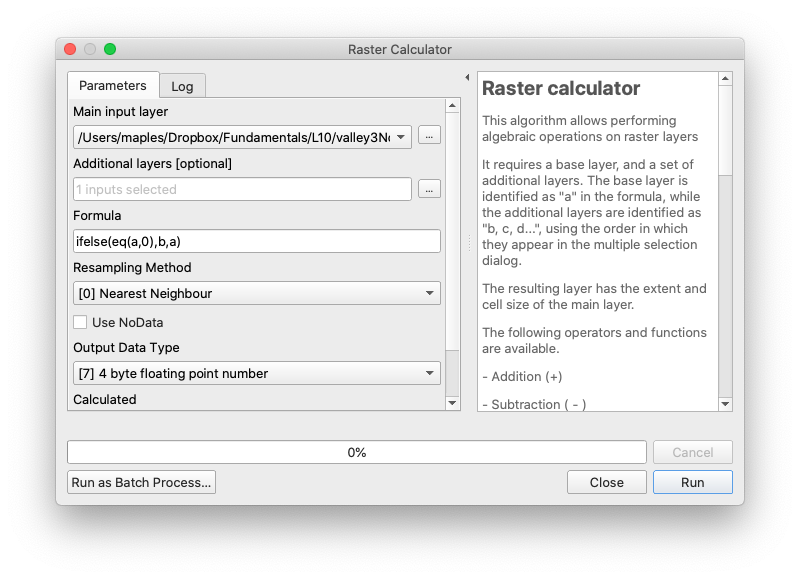

# Alternative Conditional Method for those using WhiteboxTools in QGIS

## resample

Something is going wrong with the CC and Bilinear Interpolations in the  Resample, when using WBT in QGIS. Instead, please use Nearest Neighbor (NN) as the method for resample, with your valley3nonull layer as the base raster.

## Raster Calculator

We use the SAGA and NOT the QGIS raster calculator because we need a comparison operation available in the SAGA toolbox.

SAGA uses a coding system for layers in a formula.  The first entered layer is represented by “a” in the formula, and the additional layers by b, c, … up to as many additional layers as you specify.

Use the **Processing Toolbox>SAGA>Raster Calculus>Raster calculator**

1. The main input layer is **Val3_nonull**. This is the higher resolution data layer, with zeros substituted for the nulls in the missing area you created. It is associated with the value a in the formula.
2. The Additional layers option is opened by clicking the right side button (arrow 2), which opens a Multiple selection window.
3. Click the checkbox for the layer v9to3 in this window (arrow 3).  This **Valley9_3m** layer is **_the resampled 9m to 3m data set_**, and since it is specified second, it is associated with b in our formula.
4. Our formula:

`ifelse(eq(a,0),b,a)`

uses a comparison/assignment, which read as:

`“If layer a is equal to 0, use layer b, else use layer a”`

Here we have only two files, so we can only enter a and/or b for files in our formula. **ifelse** is the SAGA version of the **CON** function, described in the chapter 10 of the GIS Fundamentals textbook. Refer to that book for an explanation of the conditional function.

The resulting layer should have 3m  cellsize, and  values from both datasets. This is easier to see, once you have created an Hillshade.

