# Collector for ArcGIS 101:

## Collecting Field Data with ArcGIS Collector

**ArcGIS Online** is becoming the fully functional online GIS that it has always promised. This workshop is designed as an introduction to **ArcGIS.com** and **Collector for ArcGIS**, and assumes some familiarity with spatial data and basic GIS terminology.  Participants will explore a  workflow for creating and managing multi-user spatial field data collection projects using nothing but a browser and consumer-grade mobile phones (iOS or Android).

Participants will learn to:  

* Create empty "feature classes" to hold spatial data
* Customize the data schema to the field data need
* Create "Lists" to drive in-app dropdown menus for controlled vocabularies and standardization
* Customize field survey forms for usability
* Enable attachments (such as audio, video or images)
* Enable offline, "disconnected" editing, for remote, off-network, data collection
* Deploy a field data collection app from ArcGIS.com to iOS or Android devices with the Collector app installed
* Share the app and editing role to a controlled group of users
* Download the field data collection app and basemap for offline use
* Collect data and sync to the ArcGIS.com database
* Create a simple read-only view of the live data, for monitoring data collection
* Export the data to multiple formats

By the end of the workshop, participants should be familiar enough to create their own field data collection applications, customized to their research needs.

## Part 1: Create a Feature Layer  

### Login to arcgis.com  

1. Go to [https://stanford.maps.arcgis.com/home/signin.html](https://stanford.maps.arcgis.com/home/signin.html) and **Login** using your **SUNetID & Password** using the Stanford University option.  

  

### Create an empty feature layer

2. Go to **Content**, and in **My Content** click **Create** and choose **Feature Layer** to open the **Create a feature layer** dialog.  

3. Select the **Build a layer** category, select **Points, lines, and polygons**, and click **Create**.  

4. **Rename** the individual **point, line and polygon layers**  

  shape|name
  ----:|:----
  point|Place
  line|Path
  polygon|Area of Interest  

5. Set the **extent** for your layer and click **Next**.  

6. Provide a **title**, like "**Walking Tour**".  *Since this must be a unique name in your organization, you might need to include your initials if others have followed these same steps*. Click **Done**.  

  

Your **Walking Tour layer** is created and its item details page should open. In the following steps you’ll create the fields that define the form for the Places layer.  

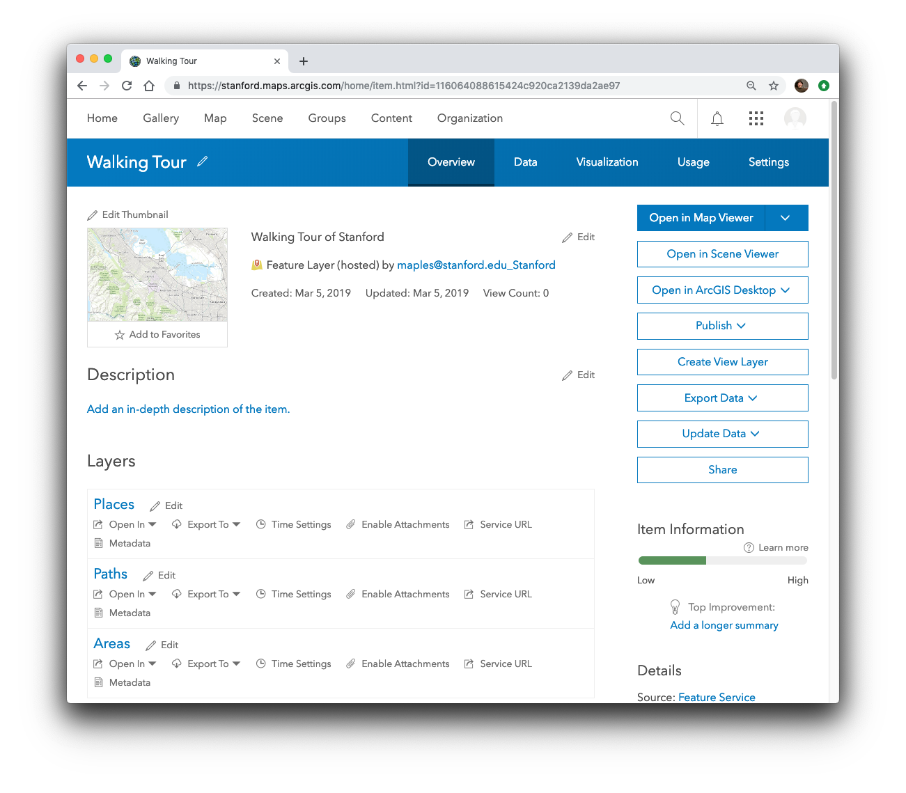   

### Add fields to the feature class

7. Go to the **Data tab** of the item page and go to **Fields**. If you created layers for points, lines, and polygons, verify that ***Place*** is chosen in the list of layers.  

  

8. Click **Add**. Give a name ***PlaceType*** and an alias ***Point of Interest Type***. Choose type: **String**. Accept the other defaults and click **Add New Field**.  

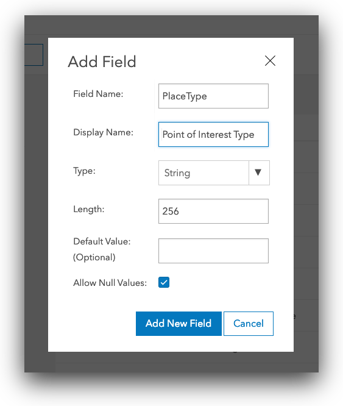   

### Create a Domain (values list) for the places layer

9. Click ***Point of Interest*** in the Display Name list and click **Create List** to create a list of choices for the **POI Types**.
Type a label of **Art** with a code of **0**.  

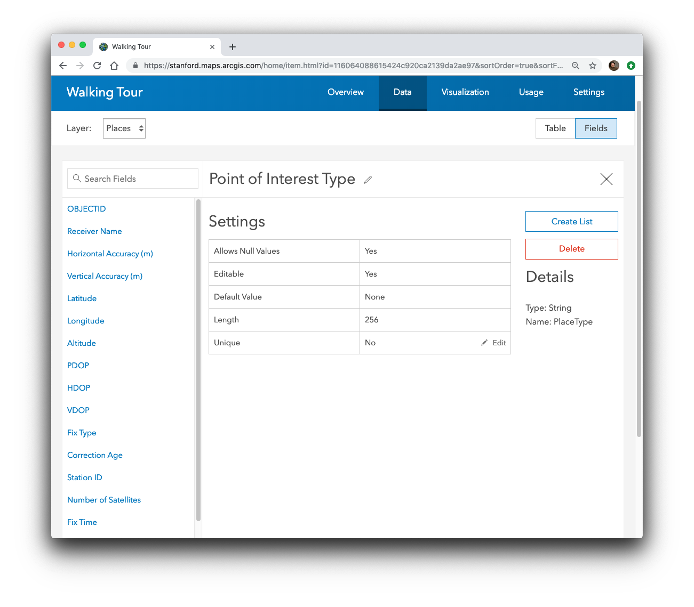  

10. Add entries for the following:  

  label|code
----:|:---
Art| 0
Architecture| 1
Gadgetry| 2
History| 3
Other| 4  

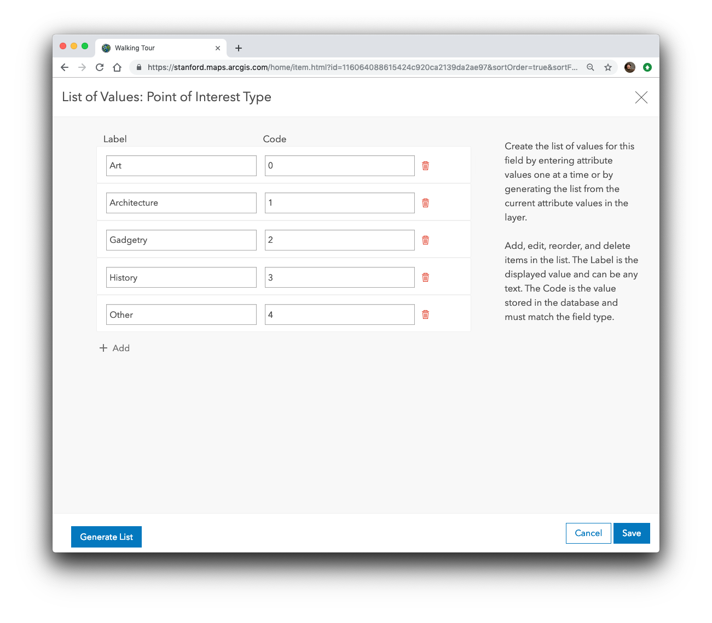  

11. Click **Save**.   
12. Create another field named ***Label*** that is a **String**.   
12. Create another field named ***Notes*** that is a **String**.  

   

  Since you want to be able to attach pictures showing the POIs in the Walking Tour, enable attachments:  
14. Go to the **Overview tab** of the item details page, scroll to the **layers list**, and click **Enable Attachments** for the Places layer.  

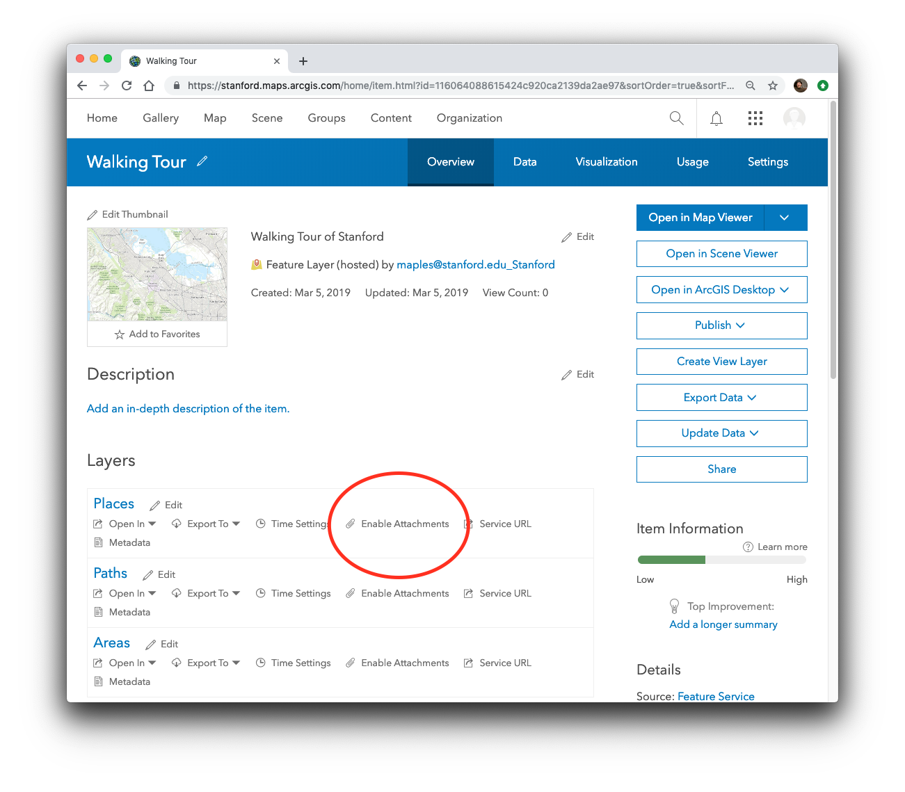   

### Enable offline editing for Collector  
This is a step that MUST be done before adding your feature layers to an ArcGIS Online map for creating your editing app.

1. Click on the Settings tab at the top of the Feature Layer's Details page.

2. Make sure that settings under the Editing section at the top are all enabled, in particular that "Enable Sync" is checked.

3. Note the other settings for controlling who and how data can be edited.

 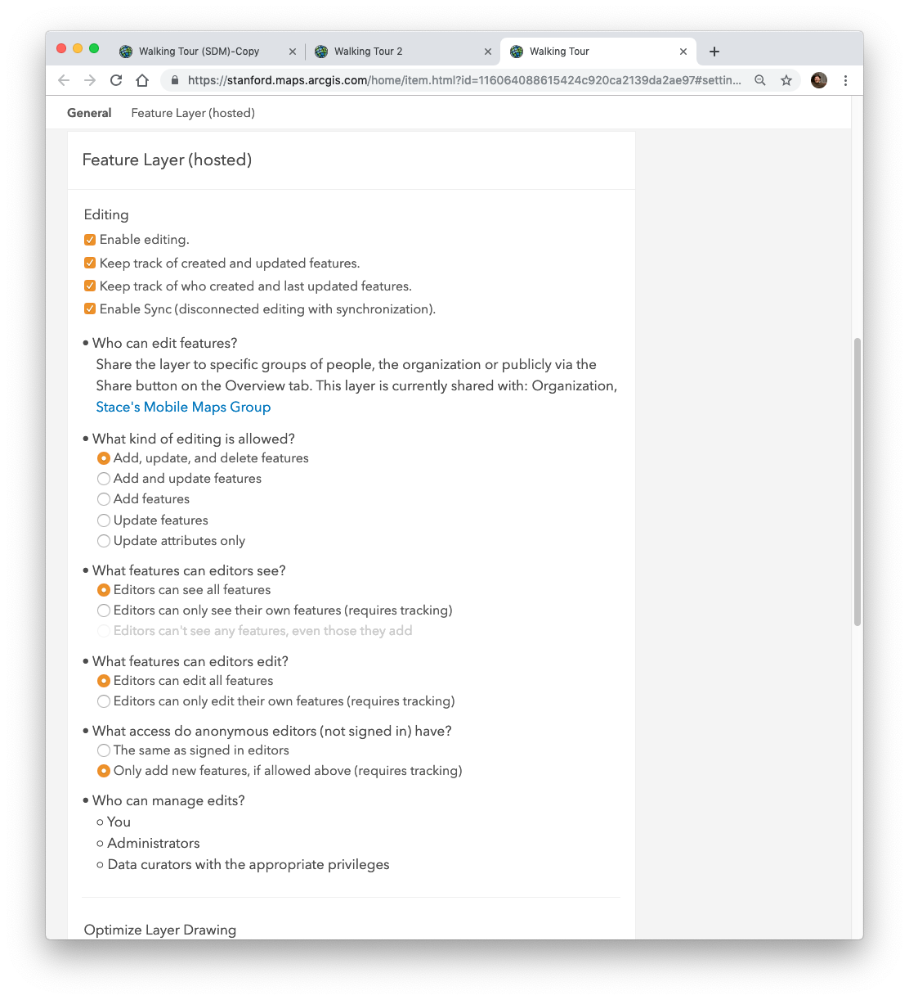  

4. Click Save to save these settings.

## Part 2: Make a map  

Now you will add the feature layers you created to an ArcGIS.com map. This map will drive the functionality in teh Collector for ArcGIS application, so everything we do from this point will be to improve the simplicity of use for our data collectors in the field.

1. Return to the Overview tab the **item page** of your layer, in the drop-down list for **Open in Map Viewer with Full Editing Control** pick **Add to new map** to start making your map.   

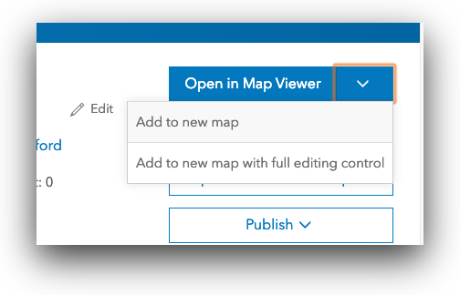  

2. **Save** your map, giving it a title "**Walking Tour [***Your initials***]**" and a **tag**.  

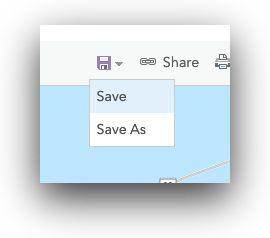  

Shortening the names of our layers in the Map will simplify the appearance of those items in the resulting Collector application.

3. In the **Contents pane**, hover over the layer of places, click **More Options**, choose **Rename**, and rename the layer of places to Places.
4. Repeat for the Paths & Areas layers.

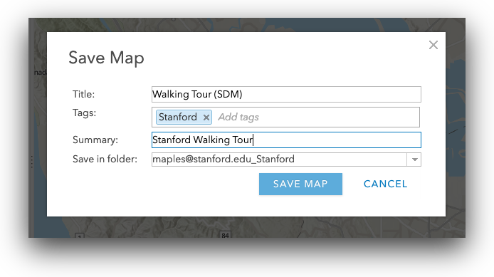  

4. Click **Change Style** for the **Places layer**, Choose to show the **Type of place** attribute.  

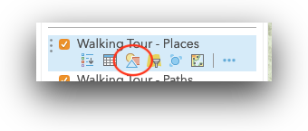  

5. Click **Options** for the **Types (Unique symbols)** drawing style.
6. Click the **symbol** next to the **Art** POI Type, click **Shape**, choose an appropriate symbol and set it to a size of **20**, then click **OK**.  

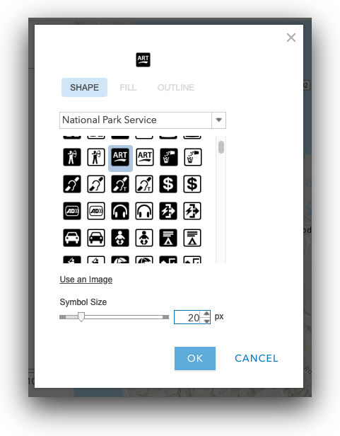  

7. Configure the symbols for the each of your other POI Types. Explore the various symbology categories available.  

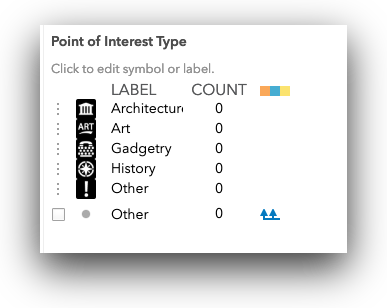  

8. Click **OK** and click **Done**.  

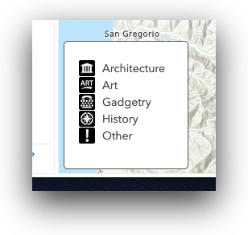  

8. Click **Edit**, click **Manage**, and click **Save Changes**.  

  

*This creates feature templates that Collector will use as the POI types available in the app*.

9. Click on the ellipsis (...) at the end of the Places layer item and go to "Configure Pop-up"

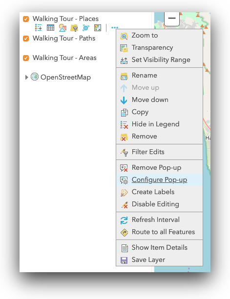

10.  Click on the "Configure Attributes" link, about half way down the "Configure Pop-up Panel."  

11. **Check**, then uncheck, the Display checkbox, to turn off the display of all attributes in the Pop-up.

12. **Scroll** down until you see the attributes you created **[{Label},{notes},{PlaceType}]** and check the **Edit** checkboxes (which will also check the Display checkbox)

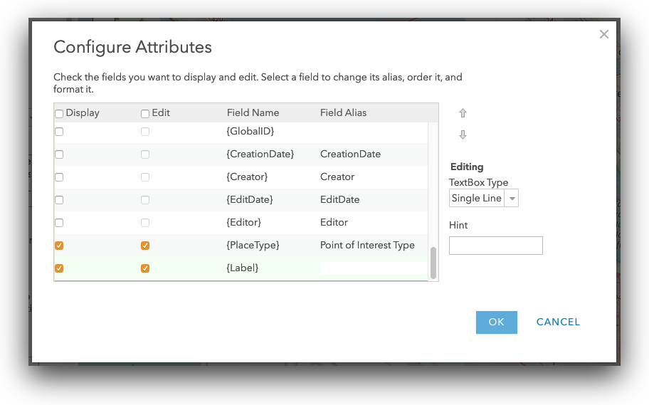  

13. **Click OK**, twice, to commit your changes and close the **Configure Pop-ups** panel.

9. **Change** the **basemap** to **OpenStreetMap**  

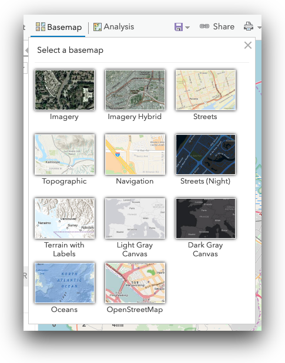  

9. **Save** the **map**.  

  

### Enable Offline Editing

10. At the top of the Table of Contents in your map, **click** on the **Details**  button and then on the **More Details...** link to go to the Details page of your webmap.

11. **Click** on the **Settings tab** at the top of the page and scroll down to the section labeled "**Offline**."

12. Make sure that "**Enable offline mode**" is active.

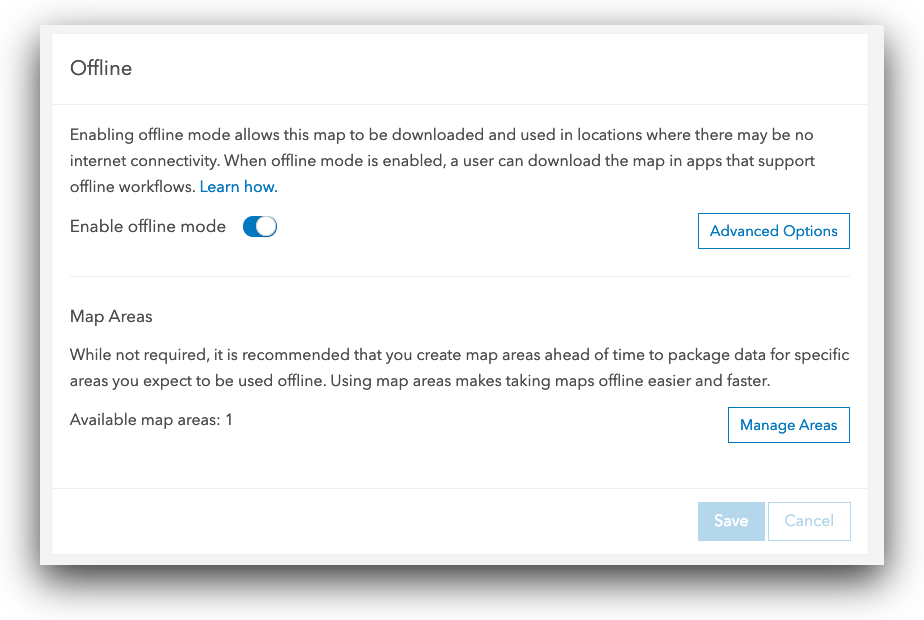

13. **Save** your **map settings**, if necessary.

## Part 3: Record Points of Interest with Collector  
Open Collector, using "**stanford**" as your organization, and your SUNetID and password.  
1. Choose the map you just made.  
2. To add a feature, touch the + sign and follow the prompts.

Note: Either sign in with the same account you used to make the map, or share the map with a group and sign in as a user that is a member of that group.
Walk around campus, adding public art, historically significant locations, various technology around campus, and "other" locations (picnic tables, restrooms, water fountains, etc...).

*This tutorial was adapted from the excellent "[Make your first Collector map](https://www.esri.com/arcgis-blog/products/collector/field-mobility/make-your-first-collector-map/)" tutorial by Kylie Donia, of Esri*.

# Sections to expand on if time permits...

## Part 4: Multi-user editing

### Create a Group
### Share the map and feature layer with the group
### Approve group membership requests

## Working with the data

#### Creating a "View Layer"
#### Create a View Map
#### Share the View Map
#### Creating an app to show the data to others  
#### Exporting the data
