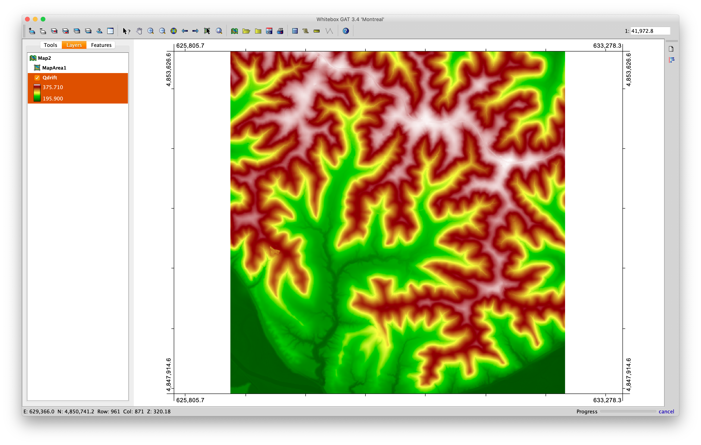
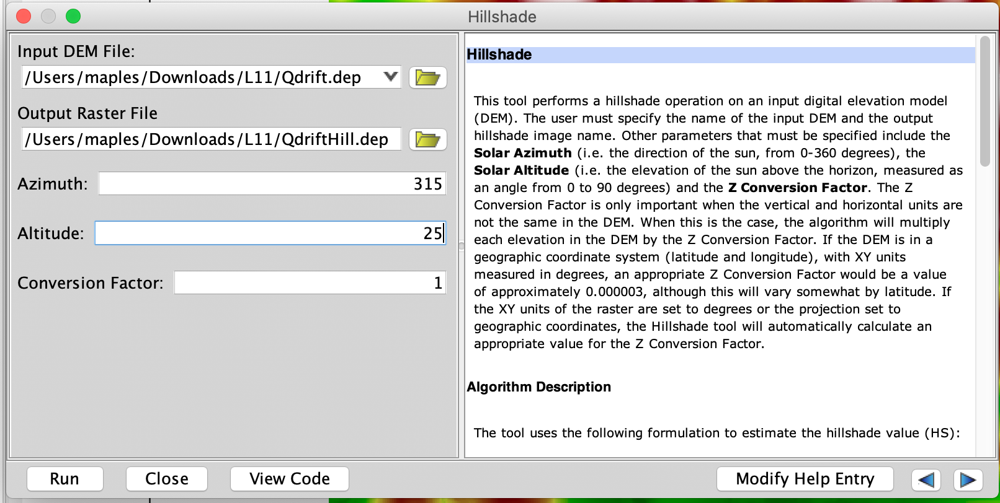
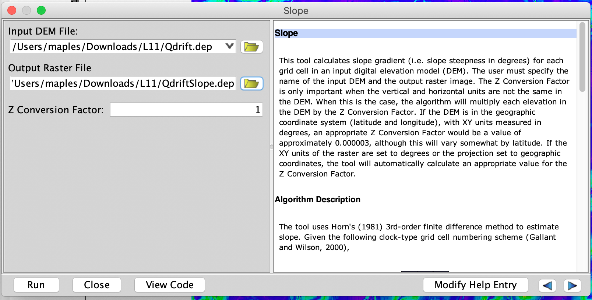
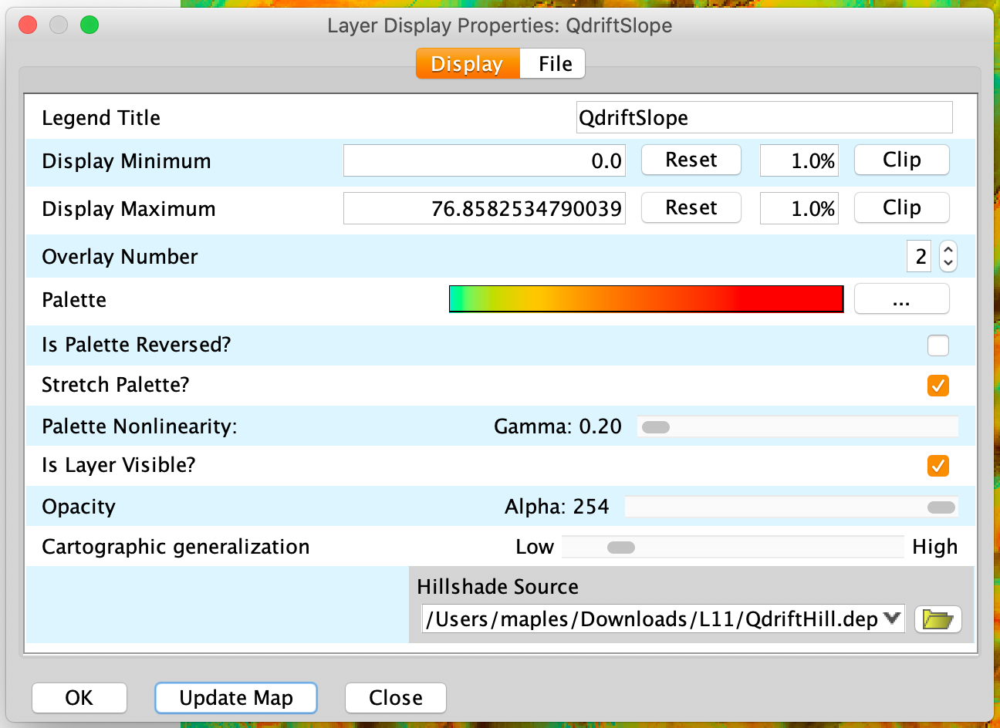
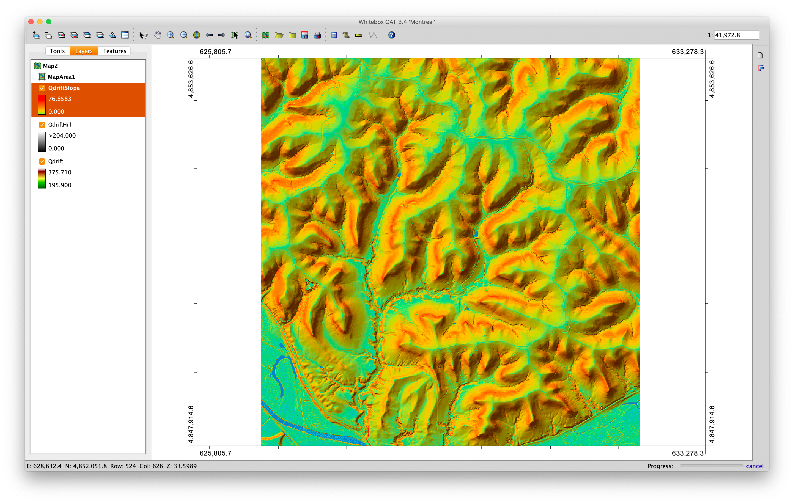
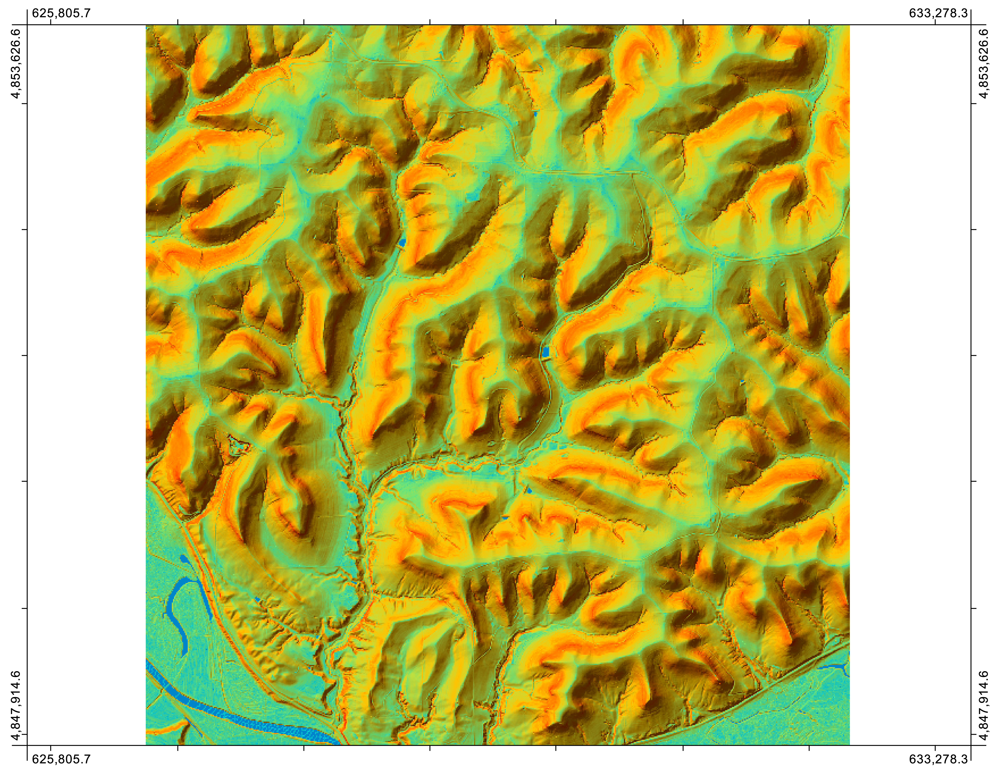

**Project 1: Raster Surfaces, Profiles, and Viewsheds**

If you haven't already, start **Whitebox GAT,** by clicking on WhiteboxGIS.jar, in your download/installation directory.

1. Use the Add Layer tool at the top left of the main window to add the Whitebox compatible DEM, **Qdrift.dep**.

2. Calculate a hillshade for **Qdrift** as **QdriftHill**

3. Calculate the Slope of **Qdrift** (Use the Search box in the Tools Panel to find the Slope tool), as **QdriftSlope**

4. Click on Layers link at the top of the TOC, then right click on the **QdriftSlope** layer in the TOC, then **>Layer Display Properties>**

5. Change the Palette to something you like

6. Set the **Hillshade Layer as **QdriftHill**

7. Click **Update Map** to see the changes, and adjust them if needed. In particular, try using teh Palette Nonlinearity slider to get a better symbology for your Slope data.

8. When you are done, close the Layer  Display Properties and Toggle off the visibility of the QdriftHill layer and you should get a display that looks approximately like the figure below

## To turn in:

1. Add your Name using the Cartographic menu,  as we did previously, then **Cartographic>Export Map as Image**

