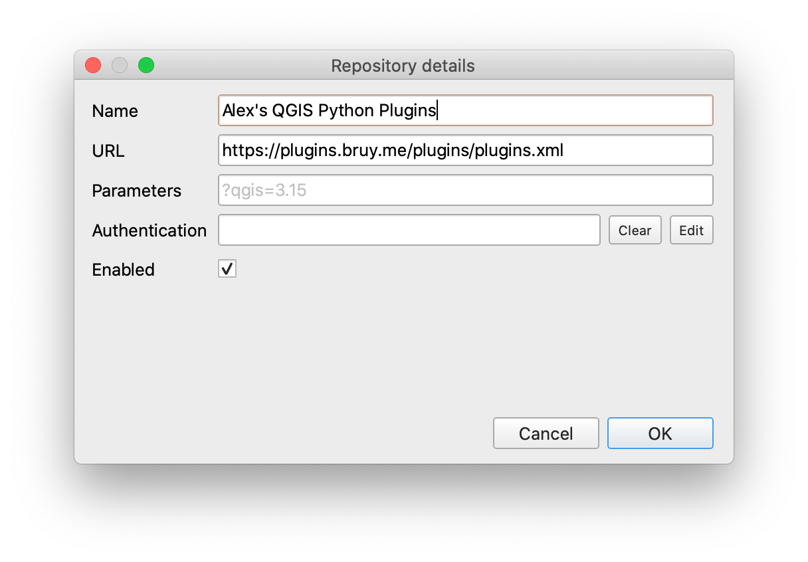
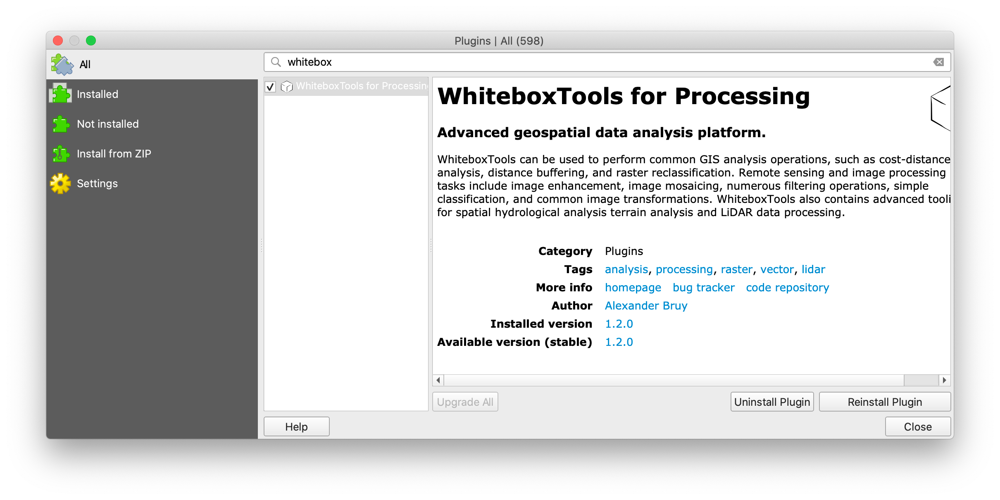
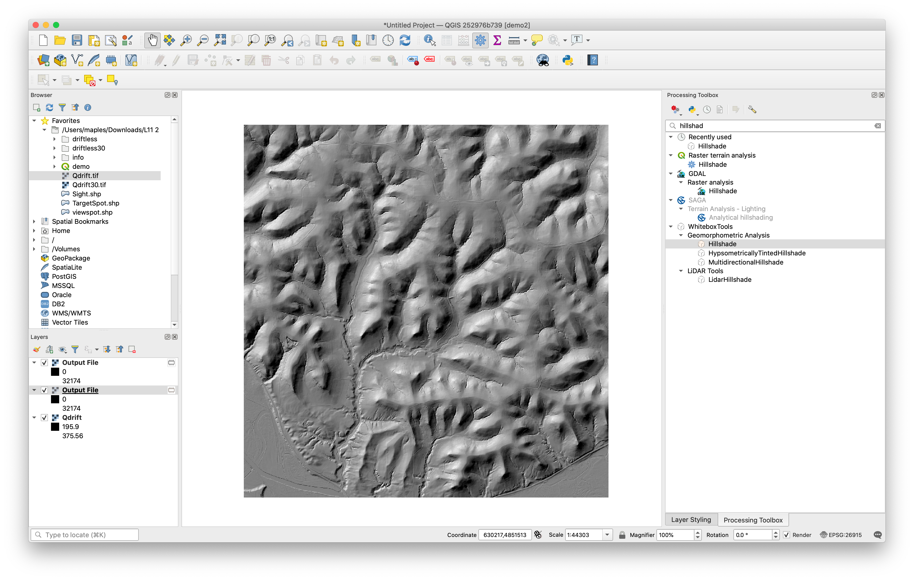

# Installing WhiteBoxGAT

Whitebox is free and open source, and although many of the functions are available in QGIS, as we have seen in QGIS many are works in progress, and somewhat problematic in application.

Whitebox GAT software is available from:  [http://www.uoguelph.ca/~hydrogeo/Whitebox/download.shtml](http://www.uoguelph.ca/~hydrogeo/Whitebox/download.shtml)

## Installation

**Download** the sofware from the above URL, **unzip** it, then **move** it to a secure location on your computer where it won't be accidentally deleted, or synced to Dropbox/Box.com/Google Drive/iCloud, etc...

The Guidance on the homepage mentions updating your Java SE, but you should try running the software, first, as some folks are having issues with newer Java Version not running the app. I've had good luck with the default version of Java on my Mac, which is running MacOS **Catalina 10.15.7**

### Troubleshooting WhiteboxGAT installation issues:

 - If you are on a Windows 10 machine, try running the application by opening the Whitebox.bat file, rather than the WhiteboxGIS.jar file.
 - If you are on a Mac, be sure to **right-click** and select **Open**, rather than double-clicking the application to run, the first time. This is because the applicaiton was downloaded outside the Apple Store, and to MacOS won't run it without some extra effort.  
 - If you are on a Mac and still having issues with starting WhiteboxGIS.jar, then try updating your Java SDK using this file: https://drive.google.com/file/d/1-inpVbJ-jhN0Owr4osNcacbCAR41MESX/view?usp=sharing
 - If that still isn't working on your Mac, try the following:

1. **Right-Click** on the **folder** that your WhiteboxGIS.jar file is in (it's probably called **WhiteboxGAT-mac**), then go to **Services>New Terminal at Folder** which should open a Terminal Window.
2. Type the following into the Terminal window:

`java -jar WhiteboxGIS.jar`

If this works, you may simply need to start WhiteboxGAT using this method, for teh  time being.

# Installing WhiteboxTools & the QGIS Whitebox Plugin

Some users are having issues with WhiteboxGAT running because of Java version issues, which are a little diffiult to troubleshoot. An alternative is to use WhiteBoxTools (a different, but related package), and to integrate the WhiteboxTools into QGIS using a new Whiteboxtools plugin.  The caveat is that Whiteboxtools QGIS Plugin only works with QGIS 3.12 and higher, which means you need to use the 3.14PR version, from teh main website, here:  
Here are the steps:

1. Download WhiteboxTools for your OS, from here: https://jblindsay.github.io/ghrg/WhiteboxTools/download.html
2. **unzip** it, then **move** it to a secure location on your computer where it won't be accidentally deleted, or synced to Dropbox/Box.com/Google Drive/iCloud, etc...
3. If you are on a Mac, Browse into the **WBT** folder and **right-click>Open** the **whitebox_tools**  **Unix Executable**. You will probably see a security warning, with the option to **Open** the file, anyway, which you should do. THis makes sure that QGIS doesn't run into the same security message, which will just throw an error.
4. A Terminal window will open, aand you should see something like the below:

5. Close the Terminal Windows
6. Open QGIS PR or Nightly (3.14+)
7. Open the QGIS Plugin Manager from **Plugins>Manage & Install Plugins...**
8. Click on the **Settings** tab and scroll down until you can see the **Add** button for **Plugin Repositories**
9. Add "Alex's QGIS Python Plugins" using  https://plugins.bruy.me/plugins/plugins.xml as the URL

10. Return to the **All** tab, and search for "**whitebox**" and install the resulting plugin. If you don't see it, double-check that you are using QGIS 3.14+

11. Close the Plugin Manager and **Open** the **Processing Toolbox**. You should now see a new toolset at the bottom:

12. Click on the Settings button  to open the Processing Settings.
13. Expand the **Providers** group, then expand **WhiteboxTools**, until you see the WhiteboxTools executable setting item. Double-click in the box to the right to use the ellipse button  to browse into your WBT folder anad select the sam whitebox_tools Unix executable you ran earlier. Click Open, and you should end up with something that looks like below, but of course with the path to YOUR file:

14. Click OK in the Processing Settings and return to the Processing Toolbox
15. Add a Digital Elevation Model from one of our homework exercises and use the **WhiteboxTools>Geomorphological Analysis>Hillshade** to test the tool.

