# Week 3 Lab: Digitizing in QGIS

**_What You’ll Learn_:** In this Lab you’ll be introduced to basic digitizing (going from a reference image, to a vector dataset) techniques using QGIS.

**You should read** Chapter 4 in the GIS Fundamentals textbook before starting this lab, as the chapter covers the basics of data entry and digitizing mechanics.  You will digitize and edit features based on a digital aerial photo.

## Getting ready for the lab

Download the data: [https://drive.google.com/file/d/1mD8NcG0z928kYq3vf2aheqbmmZLgp6Aw/view?usp=sharing](https://drive.google.com/file/d/1mD8NcG0z928kYq3vf2aheqbmmZLgp6Aw/view?usp=sharing)

Data include:

* `StXimg.img`, an image file that you’ll use as a data source.
* `NewSubdivBoundary.gpkg`,
* `OldFarm.gpkg`

All data are in `UTM Zone 15, NAD83 coordinates or NAD83`.

## Getting Started

1. **Download and unzip** the data for the lab. (_Please note that double-clicking a .zip file in the MacOS will extract it, but to extract a zip file in Windows, you must right-click and Extract…_)  

2. Start QGIS and immediately save your Project file to the unzipped lab data folder.

3. In the Browser Panel, open your **Project Home** folder and Right-Click the `StXimg.tif` file and **Add Layer to Project**

4. Right-click on the `StXimg.tif` layer and use **Layer CRS>Set Project CRS from Layer **to change the project CRS.

The image is a high-resolution scanned photograph.

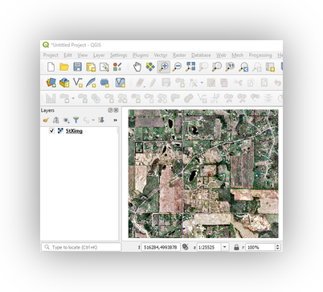

## Create New Empty Layers

The first step in creating a new spatial dataset using “heads up digitizing” is to create a new empty layer for your features to go into. In this case, we will create an empty **shapefile.**

1. Create layers using the **Layer>Create Layer>New Shapefile Layer** tool.

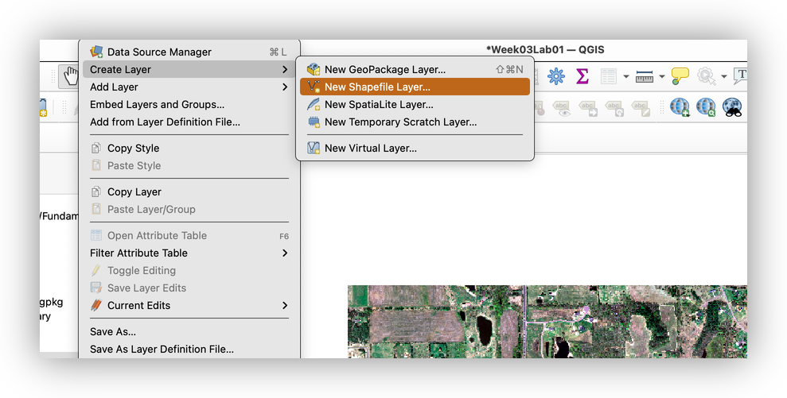

It should open a window with entries for a Database name, table, Geometry type (e.g., point, line, polygon), a coordinate system, and field characteristics for a table:

**Create three layers**:

For the first Layer:

1. Browse to your Lab Data folder and **_Name the File_**: **buildings**
2. Set the Geometry type: **point**
3. Set the coordinate system: **EPSG:26915 - NAD83 / UTM zone 15N **(Use the drop-down list to select the Project CRS)
4. Leave the remainder of the options: **blank**
5. Click **OK**

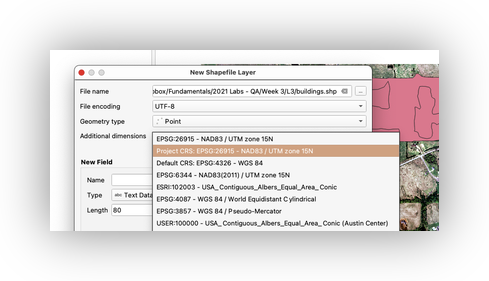

For the second layer, use the same coordinate system as above, but

1. Browse to your Lab Data folder and _name_ the Database: **roads**
2. Leave the Table name: **blank**
3. Set the Geometry type: **LineString**
4. Set the coordinate system: **EPSG:26915 - NAD83 / UTM zone 15N**
5. **L**eave the remainder of the options: **blank**

For the third layer, also use the UTM system,

* Browse to your Lab Data folder and _name_ the Database: **ponds**
* Leave the Table name: **blank**
* Set the Geometry type: **polygon**
* Set the coordinate system: **EPSG:26915 - NAD83 / UTM zone 15N**
* **L**eave the remainder of the options: **blank**

## Digitizing Features

**We’ll begin with the simplest of digitization tasks, “attributeless point features.”**

We most often add features with the Digitizing and Advance Digitizing toolbars.

Basic Digitizing is typically a default toolbar, Advanced digitizing often not. You can display the Advanced Digitizing toolbar through View-Toolbars (see figure below).

## Snapping

Before we start adding features we should **set up the Snapping environment**.

You should know about snapping from the textbook readings, if not, review them prior to doing this section.

1. On the Main Menu, go to **Project>Snapping Options...**
This should display a **Project Snapping Settings** bar, a portion of which is shown here:

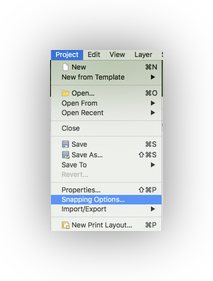

2. Click on the horseshoe magnet to **activate** dropdowns and options.

  

3. Set snapping to apply to **All Layers**, **change the snapping to meters**, and **set the snap distance to 3.00 meters**. (If the snapping is not in meters, it will be in “px”. That is the button to click to change to meters.)  

_There are additional options in the setting not used here, for example, to enable Topological Editing and Snapping on Intersection. Also note that to enable types of Snapping other than vertex, you use the dropdown, and click on each of the snapping types you want to  enable._

## Creating Features

1. **Click on the layer you want to edit (start with buildings) **in the Layers panel on the left of the main QGIS window **to select it for editing

2. **Toggle editing on by clicking on the pencil icon** in the digitizing toolbar (see figure/arrow at right)   

3. Use the **View>Panels>Layer Styling** to set the symbology for the buildings data layer to size and color that is easily visible, e.g.,** red and 4 mms.

4. **Pan and zoom to locate a house** in the image.

5. **Click on the Add Point Feature tool** , in the digitizing tool cluster, to activate it:

6. **With editing and Add Point Feature activated, and your image at an appropriate zoom level, click on the approximate center of a building.**

_Depending on your default configuration, either a small window will open with an autogenerated feature ID (FID), or it will ask you to enter a FID. Just hit the return key on the keyboard, and a point symbol should appear over your digitized building._

_Note that you can set the “Suppress attribute pop-up…” option in the Settings>Digitizing Panel. This will significantly streamline the digitizing of attributeless features, as we are doing, here._  

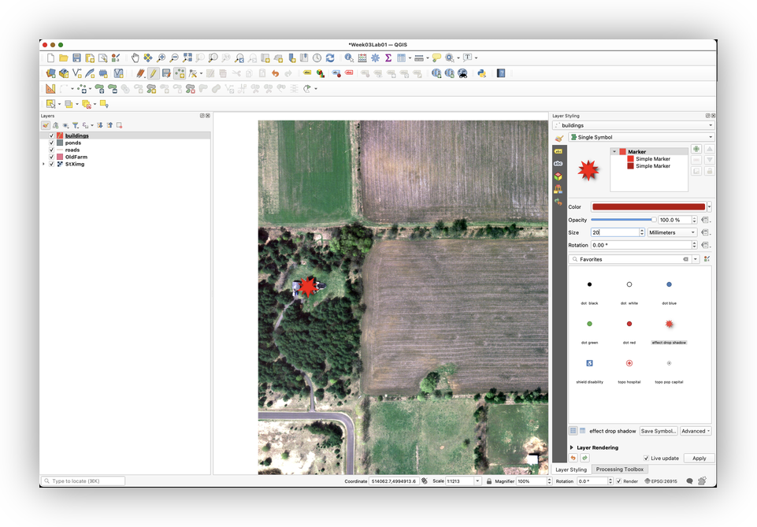  

7. Click on a second building, and the sequence repeats.

`Tip: If you create an unintended feature, use a keyboard shortcut to quickly undo (for mac users that is Command +Z, for windows that is Ctrl + Z).`

_Note: You may find it helpful to begin at the NW corner of the source image, at a Zoom level comfortable for identifying buildings, then use the Arrow Keys for panning, systematically, all the way across the North Edge, to the Eastern side of the image, then  continuing in a ZigZag until you have completely digitized all of the features._

8. Click on the multi-pencil icon, and save for selected layers, or all layers, as appropriate.

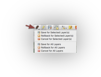

9. Alternatively, you can click on the Save All Edits button for quick saving.

10. **Save often**

### Moving a Point

If you make a mistake in placing a point, you can use the Move Point tool 

After activating the tool by a single left click, you can hover over a point, then click and release. Move the cursor to the desired position, and left click again, and the point should move to a new location.

### Deleting a Point

If you’ve noticed an error after you’ve digitized a point you can use the Select Tool  found on the main tools ribbon, usually across the top of your main window frame.

Click on the icon to activate the tool and click-drag over a point to select it. select a point. Press the delete key on the keyboard to delete the feature.

You can hold the shift key on the keyboard and sequentially click-drag to select several features.  A subsequent press of the **delete** key on the keyboard will **delete all the selected points** at once.

## Finishing Up

**Digitize all the buildings in the image and save them into your buildings layer. Include all houses, barns, sheds, or other buildings you would expect to have a foundation, but do not digitize trailers, gazebos, or similar features that may be moved or aren’t likely enclosed spaces.**  _You will have to use your best judgment; most professional workflows would allow you to tag points as uncertain and perform a field inspection._

For this work, use the example image as a guide for the approximate number. You don’t have to match exactly, just a reasonable best effort.

11. **_When you are done, be sure to save your edits, and toggle the Edit Button to deactivate editing for this layer._**

## Digitizing Lines

Next, we’ll digitize lines. Here, we are simply placing Vertices, in sequence. Often, you will be interested in topological editing, for instance in digitizing in a consistent direction of numeric address change for streets, to make the process of applying street numbers and other attributes, so that _directionality is_ encoded into the structure of the data.

1. Toggle off the visibility of the **buildings **layer and **add/activate the road layer for editing** (using tools you learned above).  
2. Set the line symbology to something visible, like Yellow 1.6mm, using the Layer Styling Panel.   
3. **Activate snapping** via the **Project>Snapping** **Options** toolbar, and set the **snap distance** to between **5 to 10 meters (_snapping is something of a personal preference, experimenting with these settings can also help you understand how the setting affects your editing_)**.  

4. Make sure you have **enabled snapping for vertexes and segments, and at least the active layer through a dropdown **(figure below).

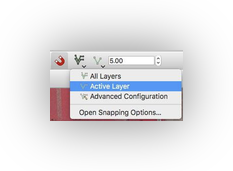

5. **Toggle on snapping at intersections**,** and topological editing**. You can tell the intersections and topological editing options are activated because the button becomes a slightly darker grey (figure below).  

6. Begin digitizing Toggling on Editing, using the** Add Line Feature tool **in the basic digitizing toolbar:

7. Position the cursor over a starting point on a road (_the edge of the image is a good place to start_), and click successive segments to trace the course of the road. Each click will place a vertex.

8. Once you have placed the last vertex, right click to stop editing the line.
If you did not “Suppress Attribute Popup” earlier, a window should pop up asking you to add attributes.

9. You can hit enter on the keyboard to accept default attributes to commit the line to your edit session. \

10. Remember, as with point editing, to Save your Edits, often.
You may then digitize subsequent segments. If you hold the starting cursor within the snap distance of an existing vertex (or line, depending on snapping options you’ve set), the cursor will be pulled, or “snapped” to the existing line.  A click will place a vertex coincident with the existing vertex or line.

If you wish to discard a line while you’re digitizing, you can hit the escape button on the keyboard.

**To insert a new vertex** in an existing line, **activate the Vertex Edit tool**

Position the cursor over a segment where you wish to place the new vertex and do a quick double left click. This should place a new vertex on the line at your cursor position.

**To delete a line, or  line segment**, use the **Select tool**  to select the feature while editing is toggled on, then  use the Delete key.

11. Digitize the roads in the image, no need to digitize the driveways. Remember to save your edits frequently.

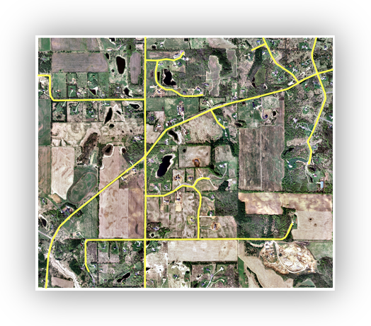

12. When finished, save edits and toggle off editing for your roads file.

## Editing Tips (Lines & Polygons)

Sometimes you need to add vertices or reposition a finished line. This can be done with the **Vertex Editing Tool**:

With the tool activated and an active layer open for editing (**_l4testlayer_** in the figure at right), when you hover the cursor over a line or polygon, it should display vertices as open circles (middle arrow, below).

A left click over a vertex activates it for movement, and a second red circle may appear around the vertex (figure below), or it may convert to a purple box.

When you move the mouse cursor to a new location, you should see dotted lines and a cross-hair that show the potential new vertex location.  A left click drops the vertex at a point.  The line/polygon boundary should reshape to reflect the move.

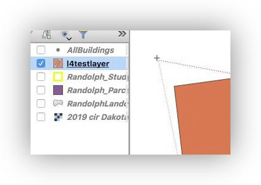  

If you wish to delete a vertex, you can select it as above, and then hit delete on the keyboard to drop the vertex.

You should be careful when selecting vertices that you do not _accidentally select an entire line_. If you click a bit off of the vertex, you can select a segment.  A subsequent move can reposition the entire line, which may be your intent in some cases, but often is not.

You can tell you’ve selected a line by a red “halo” along the length of the segment, and a small cross in the middle of the segment (example at right).  You can deselect by right clicking off the polygon/line segment, or sometimes the escape key releases the line.

If you accidentally move a vertex or line segment, remember the** Undo option** in the main QGIS menu bar

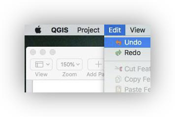

## Digitizing Polygons

1. Add the ponds layer you created, and symbolize it using something visible,  like a simple orange or  bright blue fill.

2. Zoom to display a pond, dark and usually with a convex outer boundary on this image:

3. **To digitize a pond/polygon**, first click on the **Add Polygon** button 

4. Position the cursor over the pond edge, and **click to start digitizing**. Click along the margin, placing vertices that define the pond boundary.

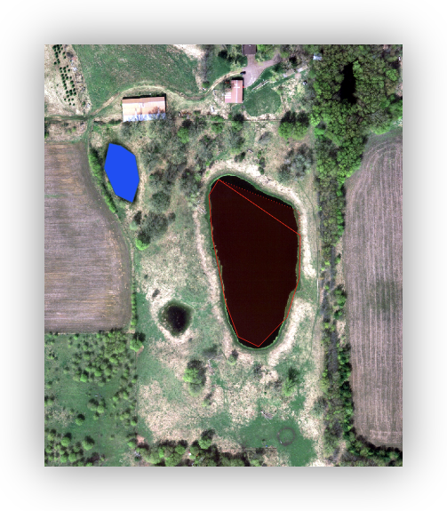

5. **After placing the last Vertex**, **Right-click to end** the polygon.

6. Digitize polygons for all the ponds on the image, using the example map at the end of this section as a guide.

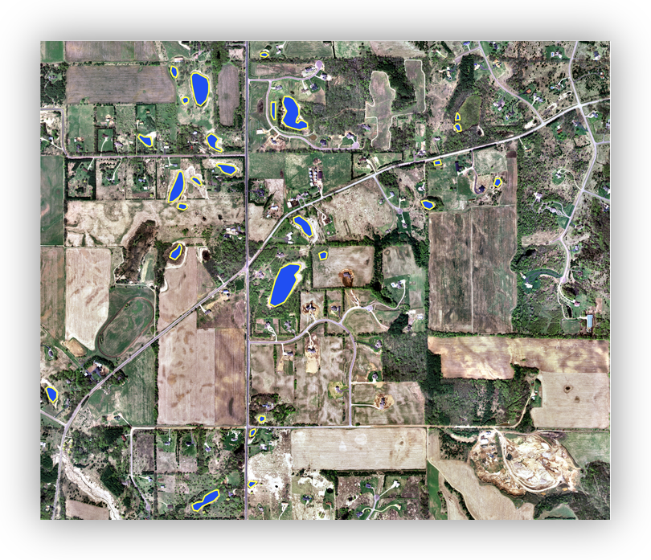

7. Make sure to frequently save your edits.

### Tips:

**Note that you can edit, add, or delete polygon edges vertices as described for lines, above and **that selection works on entire features, so that later when you are digitizing polygons, this will select and delete an entire polygon.

It is often helpful to use Properties>Symbology to make the polygon edge thicker, something like 1 mm or 3 points, and an incandescent color for easier viewing. The color depends on the dominant image and feature tone, on true color images such as these a bright magenta, yellow, or red may work, but make sure the colors are different from the colors that indicate selections.

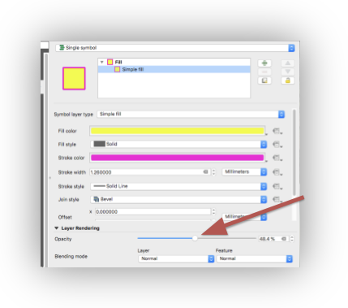

It is also helpful to set the polygon fill to a different contrasting color, and to also make it semi-transparent, so that you may see details of the image through the polygon while digitizing.

**Open the symbol panel**, select Simple Fill, and modify the Fill and stroke colors.

**Near the bottom of the Symbol window you will find a Layer Rendering section, with an Opacity slider:**

**Set the opacity to something like 50%**, so that you may see both the polygon location and features below it, in this case the land/water edge.

## Streaming in QGIS

QGIS doesn’t provide native streaming, for freehand tracing-style editing, but you can use the **Bezier Editing **Plugin (available through Plugins>Manage>All>Search=”Bezier”, which has several useful tools, including a  Freehand tool to stream points for a more convenient  way to digitize complex features, like the ponds.

[https://github.com/tmizu23/BezierEditing/wiki/Document-(English)](https://github.com/tmizu23/BezierEditing/wiki/Document-(English))

### To Turn In:

Create a layout, similar to the example map shown below. Enable all of your shapefiles and turn off StXimg (or use transparency to decrease it’s prominence).

Remember to include cartographic elements: title, your name, legend, north arrow, scale bar and the CRS used.

**Export your layout to _yourSUNetID__Week3LabEx1.pdf or *.png, and upload to Canvas.**
