## Relations in QGIS  

Relations are special joins, with the ability to create connections between tables with different numbers of records. For instance, imagine that you are responsible for the rolling inventory of street trees in your city.

Creating a new point every time you revisit a tree to re-survey isn't the presents all sorts of problems for querying and maintaining the data. Ideally, you might want to create a spatial dataset of `locations`, with a single point geometry for each tree site. Keeping in mind that each tree site can have multiple "states" (such as: Tree, Dead Tree, Stump, Planting Site, New Planting, etc...), you create a separate table to store the `survey_records` for the `locations` as you revisit the locations, year-over-year.

This is the simplest meaning of _normalizing tables_, in the context of relational databases. The object is to remove redundancy of data, and here we would be removing the need to record the coordinates, address, property ID and other properties of the `locations`, with every subsequent `survey_records` revisit.

To connect the two datasets, you use a `unique_identifier`, or _keyfield_ (perhaps a randomly generated code, or the coordinate pair of the `locations`) for the `locations` that also exists in the `survey_records` table, so that  every row in `survey_record` has the value of the `unique_identifier` for only one `location`. This would be a "**one-to-many**" relation, where **one** `locations` row might have **many** matching `survey_records` rows, depending on how many times it has been surveyed.

Not only can you very quickly query all of the `unique_identifier` records for a single `location` but you can leverage the relations in the other direction to do things like identifying the `locations` of all dead trees, or planting sites, etc..., or summarize the conditions of all trees in a particular area, by combining the relations with a **Selection by Location**.

In this exercise, you will create Relations between several datsets in QGIS in order to answer the questions:

1. What are the chemicals being released within 5km of any particular school in our study area, and their total Air and Water Release amounts

## Getting Ready
### Download the Data

1. [Download the Data from Github](https://github.com/mapninja/Earthsys144/raw/master/data/Tox2SchoolsLab.zip)
2. Unzip the data on your hard drive, preferably somewhere that iCloud or other cloud storage services won't delete you local copies.

### Install the **Actions for Relations plugin**

**I just discovered this plugin, and haven't incorporated it into the exercise, yet, but I have recorded [a video walkthrough for you to use to get you started](https://stanford.zoom.us/rec/play/Pm_DPAZ-XSCHF9q2CnOw1fd3UIg6yJmwqoqCBdHeJjPNd-WRRdLAzqJWIQJ3XJQQcqaWDeDumAdwC4Qi.aQnM1Ao7i6ZQoC5g).**

1. Use **Main Menu>Plugins>Manage and Install Plugin...** to open the **Plugin Manager **
2. Search for, and install, the **Actions for Relations** plugin.

### Install "Select by Relationship" Plugin

**_NOTE: SINCE I FIRST WROTE THIS TUTORIAL, A NEW PLUGIN HAS COME TO MY ATTENTION, CALLED_ Actions for Relations plugin, _WHICH WORKS MUCH MORE SIMPLY, AND ELEGANTLY. MY SUGGESTION IS TO USE THAT PLUGIN, INSTEAD OF THE_ Select by Relationship Plugin, _referenced below. Both will work, but the_ Actions for Relations plugin _is far simpler to use, and the results are the same._**

This plugin allows you to query tables in your project, across "relations" that are created in the Project Setting.

1. Use **Main Menu>Plugins>Manage and Install Plugin...** to open the **Plugin Manager **
2. Search for, and install, the **Select by Relationship** plugin.

### Install "Group Stats" Plugin

This plugin provides a graphical summary statistics interface for creating summaries of the attribute tables of your tables & layers.

2. Search for, and install, the **Group Stats** plugin.

### Open the Project

1. Right-click on the `toxic_sites_stateplane` layer and **>Zoom to Layer...**

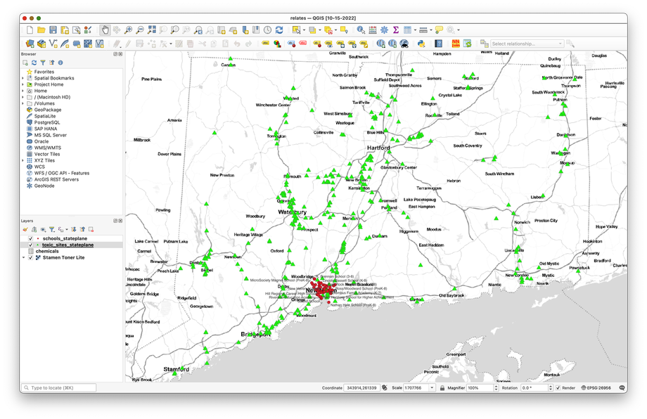

### Examine the data

1. Open the properties of the layers in the project to examine their CRS, and where they are coming from.

Note that the data for this lab is contained in a File Geodatabase. This is proprietary data format, created by Esri and mostly supported in their ArcGIS Desktop and ArcGIS Pro software. QGIS, however, has the ability to read data from a geodatabase, and we are using it here to show that it is possible to interact with data in this format, in QGIS. However, if you want to be able to write to the data (alter geometries, calculate fields, etc...), you will need to export each layer you want to alter, to a QGIS Friendly format.

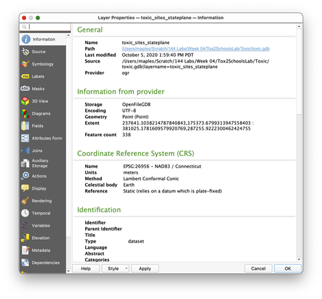

### Create a Distance Matrix  

1. Open the Processing Tools Panel (**Main Menu>Processing>Toolbox**)
2. Search for the 'Distance Matrix' Tool and open it.
3. Use the following settings for the tools:

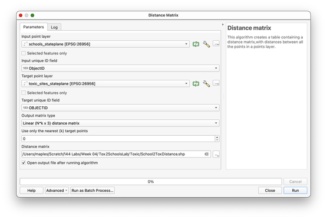

4. Click OK, to create the `Schools2ToxDistanceMatrix.shp`, which should be added to your map.
5. Toggle off the visibility of the layer, since we will only use the table, for this exercise.
6. Open the attribute table for the new `Schools2ToxDistanceMatrix.shp` layer and look at the justification of the cell values in the table (you may need to expand your columns).

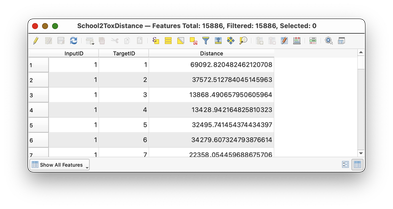

Note that the numeric values in the table are "**Right-Justified**", which indicates that they are being interpreted by the software as Numeric Type values. Here, we used the shapefile format for our table, even though we don't need the geometries for our purpose. We did this because the shapefile format carries with it metadata that tells software like QGIS specifically how to format the data in the columns of our table. Bringing a CSV table into QGIS often results in numeric values being formatted as strings, and therefore unavailable to queries like value ranges, etc...

### Filter on a Columns Values

Now we will place a filter on the table we just created to limit it to only those records that have a distance value of less than 5000m. In this way, we will be left with a table that represents all of the Toxic sites within 5km of each school, which we can use to query the chemicals being released with 5km of that school.

1. Open the `School2ToxDistance` layer's **Attribute Table** and note that you have more than 15k rows of information.
2. Right-click on the `School2ToxDistance` layer, in the Layers Panel and select **>Filter**
2. Create a Filter Expression where `"Distance" <= 5000`

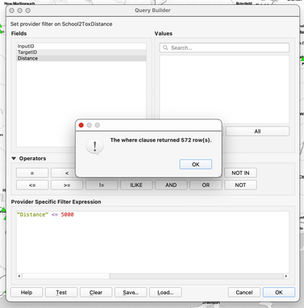

3. Click OK to apply the filter, and reexamine the attribute table to ensure that you now have 572 features.

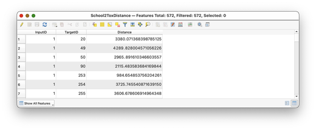

Your other records haven't been deleted. You've just created a view, (RESTRICT, in relational algebra) of the table, restricting it to those values that meet the criteria of the query you created. Because we filtered out all of the values over 5000m, the table now only contains records for Toxic Sites within 5km of a school.

### Creating Relations, in Relations_in_QGIS

Now we will begin relating our tables to one another, so that we can query across all of them, at the same time.

1. Go to **Main Menu>Project>Properties**
2. Click on the **Relations** Tab to make it active.
3. Click on Add Relation  to add your first relation.

Here, we are interested in connecting our `schools_stateplane` layer to our `School2ToxDistance` layer, and our `School2ToxDistance` layer to our `toxic_sites_stateplane` layer, which will allow us to query those `toxic_sites_stateplane` sites that are within 5km of a school.

1. First, create the following **relation**, named `School2Distance` **_from_** `schools_stateplane` [using `ObjectID`] to `School2ToxDistance` [Using `InputID`]:

2. Next, create the following **relation**, named `Tox2Dist` **_from_** `School2ToxDistance` [using `TargetID`] to `toxic_sites_stateplane` [using `OBJECTID`]

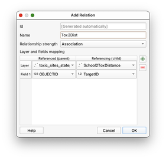

3. Finally, create the following **relation**, named `Tox2Chem` **_from_** `toxic_sites_stateplane` [using `TRIFID`] to `chemicals` [using `TRIFID`]

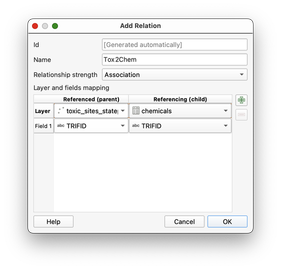

This last relation creates a connection from the `toxic_sites_stateplane` layer to their `chemicals` records.

4. Click OK to Apply your **relations**, and close the **Project Properties** dialog box.
5. Save your project.

### Using the Select by Relationship Plugin to Query Across Relations

**_NOTE: SINCE I FIRST WROTE THIS TUTORIAL, A NEW PLUGIN HAS COME TO MY ATTENTION, CALLED_ Actions for Relations plugin, _WHICH WORKS MUCH MORE SIMPLY, AND ELEGANTLY. MY SUGGESTION IS TO USE THAT PLUGIN, INSTEAD OF THE_ Select by Relationship Plugin, _referenced here. Both will work, but the_ Actions for Relations plugin _is far simpler to use, and the results are the same._**
**I just discovered this plugin, and haven't finished incorporated it into the exercise, yet, but I have recorded [a video walkthrough for you to use to get you started](https://stanford.zoom.us/rec/play/Pm_DPAZ-XSCHF9q2CnOw1fd3UIg6yJmwqoqCBdHeJjPNd-WRRdLAzqJWIQJ3XJQQcqaWDeDumAdwC4Qi.aQnM1Ao7i6ZQoC5g).**

My siggestion is to use the **Actions for Relations** plugin, after watching the video walkthrough.

1. Look for the Select by Relationship toolbar, which would have been added to the QGIS interface, when you installed the plugin.

2. Click on the **Allow Selection by Relationship** button  to activate the tool
3. Click on the Settings Button for the tool 
4. Set the tool options, as follows:

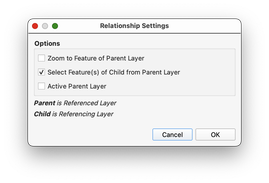

5. Click on Select Relationship...  and check all three relations (which should be the ones you created, previously).

6. **IMPORTANT:** Activate your `schools_stateplane` layer, by selecting it in the Layers Panel.
6. Use the Select Features tools  to draw a box around one of the schools in your data frame (I've chosen to focus on Edgewood Magnet School, for this example) and select that school.
7. Open the `schools_stateplane` **Attribute Table** and change the **Table View** to **Show Selected Features**, which should show only the school you selected (Here, Edgewood Magnet School)

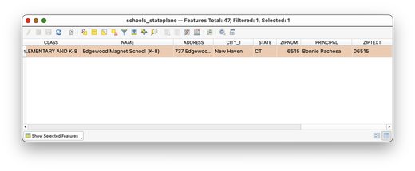

8. Now open the `toxic_sites_stateplane` Attribute Table, and change the Table View to Show Selected Features.
9. Now open the `chemicals` Attribute Table, and change the view to Show Selected Features.

You should now see that the `chemicals` records for the 'toxic_sites_stateplane' within 5km of the `schools_stateplane` selection you created, are now selected.

## Using Group Stats to Create a Summary Statistics Analysis

1. Go to Main Menu>Vector>Group Stats, to Open the Group Stats Plugin
2. Make sure that `chemicals` is selected as the target in the  dropdown
3. **Check** the option to **Use only the selected features**
3. From the Fields Panel, in Group Stats, drag objects into the **Columns**, **Rows** and **Value** panels, as shown below, so that we are:

    **COUNT**ing and **SUM**ming the variable `TTLAIR` for every **SELECTED** unique value of `CHEMNAME`

4. Click the Calculate button to create the Summary Table.
5. Click on the Column Headers to sort, as needed.

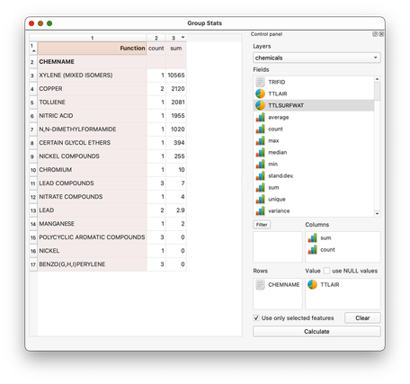

6. On the Main Menu (which has changed appearance while using Group Stats), go to **Data>Save all as CSV file**, and save your chemical report with a meaningful name, like EdgewoodSchoolChemReport.csv

7. Close Group Statistics
8. Add your Chemical Report Table you just exported back to the QGIS Project (QGIS doesn't add it by default).

# To Turn In:

Create a Map Layout:
1. With only the school you ran the Chemical Report on visible in the map (Hint: Use a filter on `schools_stateplane` like you did with the Distance Matrix, above).
2. All TRI Sites from `toxic_sites_stateplane` visible
3. A basemap of your choice (but a choice that makes sense for your operational layers, above)
4. Insert the Chemical Report Table using the Add FIxed Table tool 

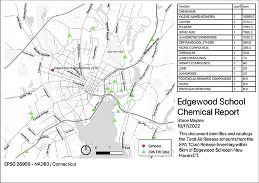
