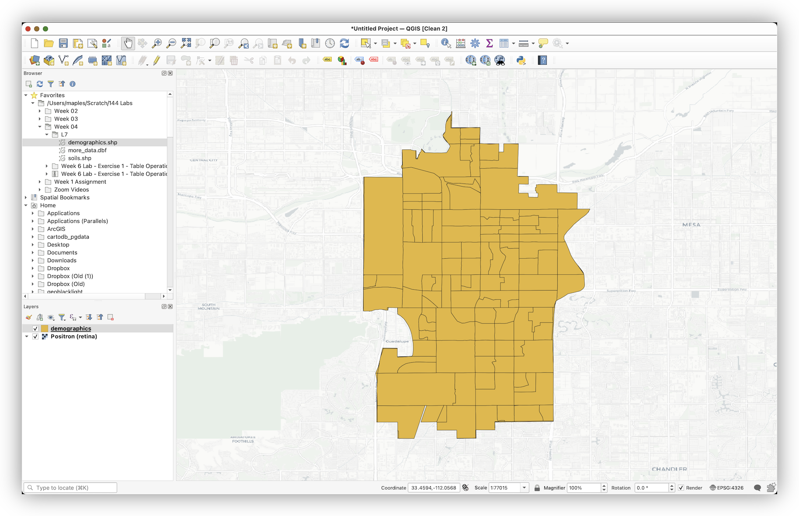
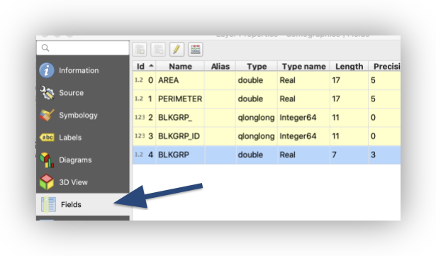
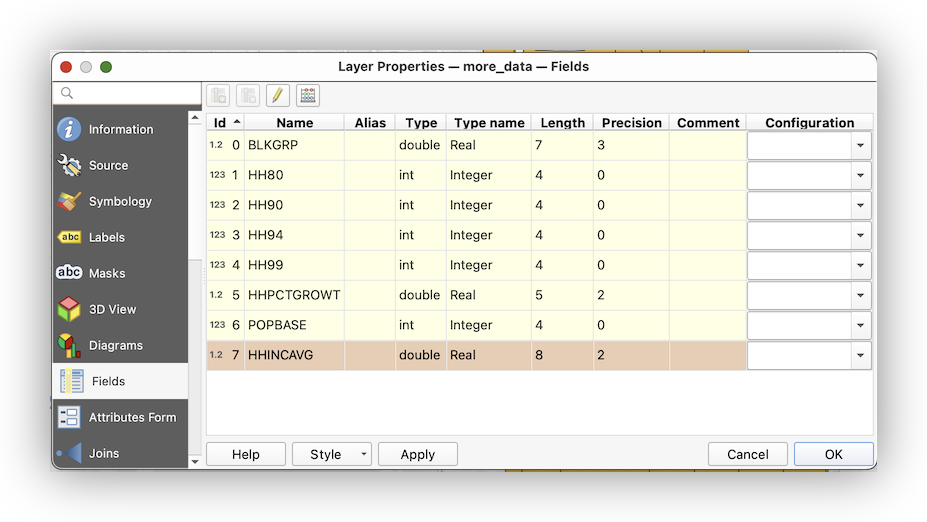
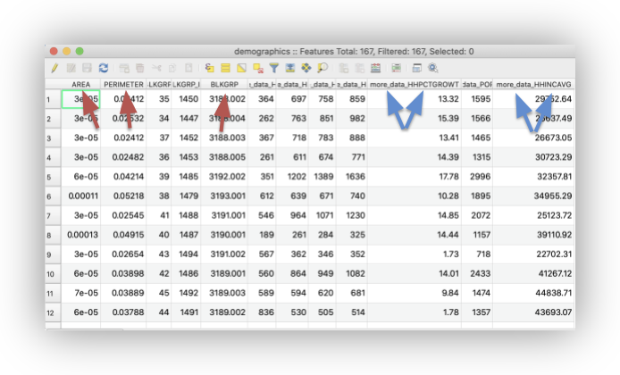
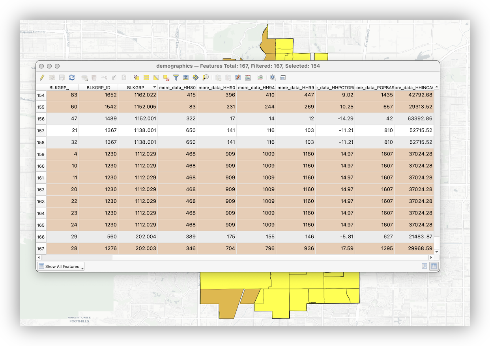
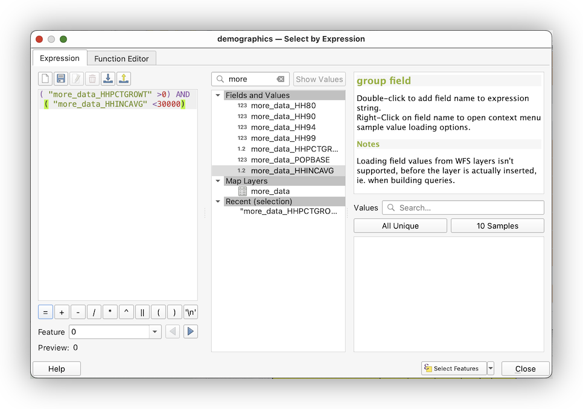
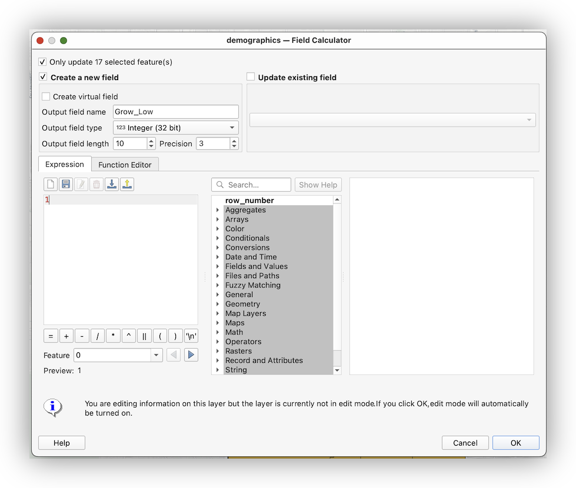
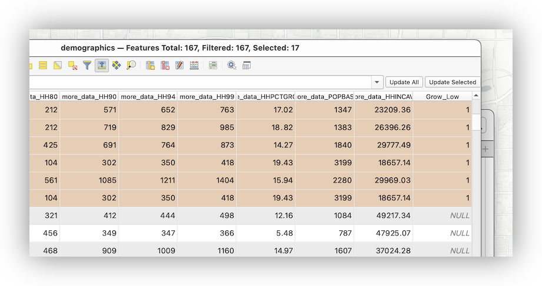
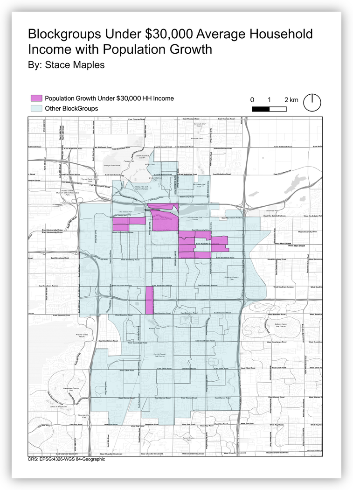

# Week 06 Lab 1: Tables Operations in QGIS

### What You’ll Learn

This Lab provides practice with tabular data management in QGIS.  In this Lab, we will view, select, re-order, and update tabular data.

You should read chapter 8 in the GIS Fundamentals textbook before performing this Lab.

### Data  
**_Data_**: are in the **L7.zip**, with census data **_demographics.shp_** in decimal degree coordinates, a table **more_data.dbf**, and **_soils.shp_** in `UTM Zone 17, NAD83 coordinates, and the units are meters`.

[Download the data from this link](https://github.com/mapninja/Earthsys144/raw/master/data/L7.zip)

### What You’ll Produce

**Three maps, two of selections based on census data**, and one of a soils data set.

### Background

Most spatial data in a GIS consist of at least two types of data, those data depicting the location and shape of objects, and text or numerical data describing the characteristics of the  objects.  These text and numerical data are most often contained in tables, and most GIS packages have some way of creating and editing these data tables.  

QGIS provides a rich set of tools for viewing and displaying attribute data.  However, you don’t have as many options for manipulating and saving new data, as with a full-featured database manager, so we’ll do some rather simple operations in this lab.  

## Examining Tables, Fields and their Properties

1. Start **QGIS**, and use the Browser Panel to browse to your **L7 folder**, then **right-click** the layer **_demographics.shp,_** and **Add Layer to Project**. This layer contains boundaries and population data on a set of urban polygons.
2. **Add** a **basemap**, if you like, using the **QuickMapServices** plugin.



3. **Open** the **Attribute Table** (**right-click** in **TOC**, then **Open Attribute Table**).  _Note the **fields**, especially one called_ **Blkgrp**.
4. **Add** the data table named **_more_data.dbf_,** using the same method you used with the **Browser panel**.
5. **Open** the **_more_data.dbf_** (**right-click** in the **Layers Panel**, then **Open Attribute Table**) _Notice that **more_data.dbf** also has a field named_ **Blkgrp**.

6. **Open the Properties** of the **demographics.shp** **layer** in the **Layers** **panel**, then click on the **Fields tab**. This should display the **name, type, and length** of each column:  



* Are the variables ordinal, nominal, or interval/ratio?
* Which variables are found in both tables?
* Which variables might serve as keys for the table, and which would be inappropriate as keys?  
_(See Chapter 8 in the Bolstad textbook, if you’re unsure on these concepts)_

**Close** this window, and **Open the Attribute Table for demographics.shp**

Each record (row) in each table corresponds to each polygon in this US Census Bureau demographic data, displayed in **_demographics.shp_**.  These files were produced from U.S. Census data, which uses a variable named **Blkgrp** as a unique identifier.  Each record in our tables corresponds to a **US Census block group**.

**Inspect the Field properties**, as you did above, for the **_more_data.dbf _table**. _Note that the **BLKGRP** variable is defined in the same way as the **BLKGRP** variable in the **demographics.shp** table_. We should be able to use this as our joining variable.



The file **_more_data.dbf_** includes populations at various dates for each block group polygon, e.g., `Hh80`=**population in 1980**, **`Hh90`=population in 1990**, **etc**...  


### Table Joins

**Table Joining** is a common operation in GIS analyses.  We often want to combine data from different sources. For example, is US Census practice to distribute the Census’ cartographic boundary files separately from the demographic variables data, since users are typically interested in only a few variables, not all of  the hundreds of variables and cross tabulations that the census makes available.


1. **Open** the **Properties** for the **_demographics.shp_** **layer (_shortcut: try double-clicking on the layer name!_)** and click on the **Joins** tab. 

2. Click on the add button near the bottom left 
3. Specify the **Join layer**: *`*more_data`**, the **Join field** (from **more_data**) as **`BLKGRP`**, and the **Target field** (in the **_demographics_** layer table) as **`BLKGRP`**.


_Note that the field names don’t have to be the same, they just happen to be in this example_

4. Now click **Apply** and **OK**
5. **Open the Attribute Table** for the **_demographics_** layer, again.



_Notice the demographics.shp table has the **more_data** fields append to the end of each record._

You’ve just successfully connected the two tables, matching the records in one table to the records in another table that have the same value for **BLKGRP**.

The field names, at the top of the column, for the fields from **_demographic.shp_** file are unchanged. The fields names from the more_data table have that **table’s name pre-pendeded**, e.g., `more_data_HHINCAVG` (see arrows in the figure above).

It’s important to note a few things about this Join:

* **This is a temporary join**; the original files/data have not been modified.  
* **QGIS keeps track of joins within a project**, and how to display the various joined files. If you were to display these data sets in another project, they would not appear joined.
* The **data are not copied to a new, combined, file**. Rather, this join tells QGIS to **_display_** these two data sets within this particular view, matching each row by the join variable.

### Selecting on a (Joined) Table & Calculating a Field

_IMPORTANT NOTE: It appears that there is a slight difference in the way some versions of QGIS (LTR vs Nightly Build, etc…) prepend the name of source tables to fields in a join. In the Nightly build, which I am editing this workshop with, an underscore ‘_’ is used, and in the LTR version, it appears that a decimal ‘.’ is used. Please keep these types of differences in mind when building queries. It is for this reason that using the Search in the Expression Editor is a good idea, then you are using YOUR field names, as your version of QGIS has built them._

Now, let’s select items based on the joined tables.  

1. Open the Attributes Table of demographics, if not already.  It should display both the original data plus the data from _`more_data.dbf`_.
2. Click on the **Select by Expression tool**  on the upper frame of the table window

From the popup window (see below), we will now build the following selection equation:


`"more_data_HHPCTGROWT">0`


3. Begin typing “**more_data_HHPCTGROWT**” in the search box at the top of the Select by Expression window, but only until you see the variable you are interested in, then **double-click** on  it to place it in the **Expression window**

4. Type the rest of the query:  `>0`
5. When you’ve created your expression, <strong>click</strong> on the <strong>Select Features</strong> button displayed along the bottom.


This should select most of the rows in the table, probably displaying them in a sort of salmon color, and yellow, in the map canvas.

**Examine your selected block groups on the map and in the table, making sure that you have only selected the block groups with positive population growth.**



1. With the **demographics layer attribute table** open, click on the button at the bottom left that currently should read “**Show All Features**” and change it to “**Show Selected Features**” and note the effect on the **attribute table**.


2. **Click** on the **`more_data_HHPCTGROWT Field Header`** to sort the column, by value, **ascending**. **Click**, again, to sort, **descending**.

3. Return the attribute table to **Show All Features view**
4. **Clear** your selection by clicking on the **Deselect All FeaturesFrom the Layer** icon  above the table.

### Create a Compound Selection

**Select** **blockgroups** that have:
* **BOTH**
* population growth greater than 0
* **AND**
* income less than $30,000

5. In the **Select by Expression **window, this **Expression** will be (for my version of QGIS):


```
("more_data_HHPCTGROWT" >0) AND ( "more_data_HHINCAVG" <30000)  
```

6. Use the Search in the **Expression Editor** to build the expression for **your specific dataset** and **examine** your selection.  



7. Activate the **Move Selected to Top** button , at the top of the attribute table, to only focus on your selected features.
* Were 17 of 167 records selected?

8. You can verify the number at the top edge of the table. If not, _re-check your selection expression_.


### Tagging records

Here we will use a simple method of calculating a binary field to identify our selected records, so that we can create a distinct symbology for those records, in our final map.

1. **Open** the **Field calculator**.  _Note its similarity to the **Expression Editor?**_
2. **Only update 17 selected features**,
3. **Create a new field**: **Grow_Low**  
4. Use **Integer (32 bit)** as the Output Field Type
5. Assign the value of ‘1’ to these **17 selected records**, by simply typing the number **1** in the **Expression panel** and click **OK**  



4. **Check** that **1** was written to a new Column called **Grow_Low **in the **attribute table**.



5. **Invert** the **selection** with the **Invert Selection button** 
6. Return to the **Field calculator**, and use the “**Update Existing Field**” to assign the value of **0** to the **Grow_Low** field for the **remaining 150 records**.  

7. Be sure to **toggle off Editing**, and **save your edits**.

8. You can clear the selection now, using the Deselect all features... button 
9. **Save your Project and retain it for the next section.**

## To turn in:

Produce a map (PDF or png), using the `Grow_Low` Field to create a **Categorized** symbology, highlighting the blockgroups that met the criteria of our Selection.   

Be creative, and remember to include a basemap for context, title, descriptive legend, name, scale bar, and CRS.

_Hint: You can control the display of the Legend, when you apply the symbology by editing the values in the Legend column of the Layer Styling Panel, and sorting on Value. **all other values** can be deleted by Highlighting and clicking on the Delete Button, at the bottom._



