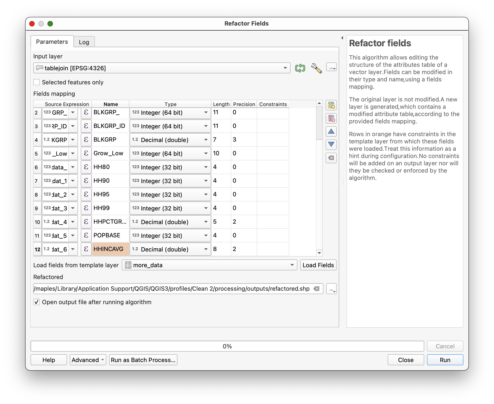
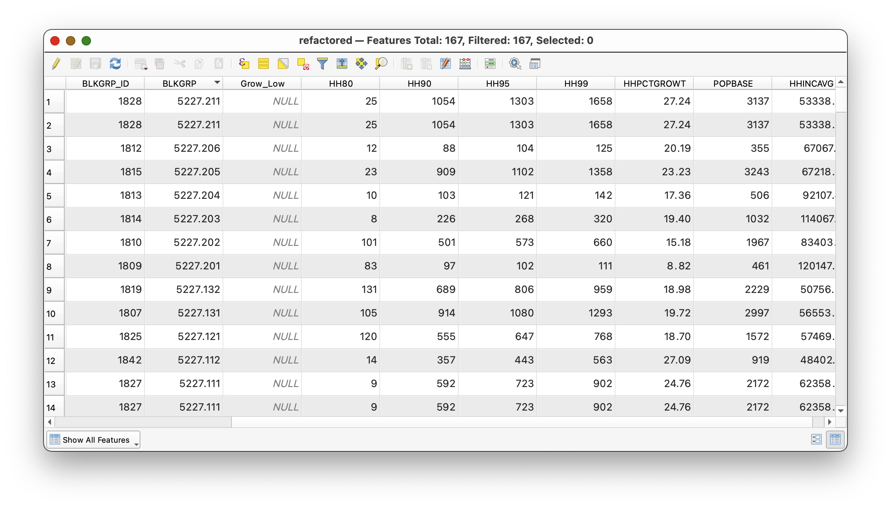
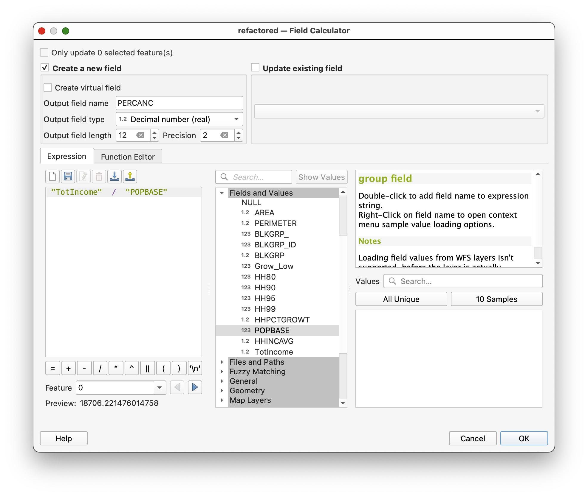
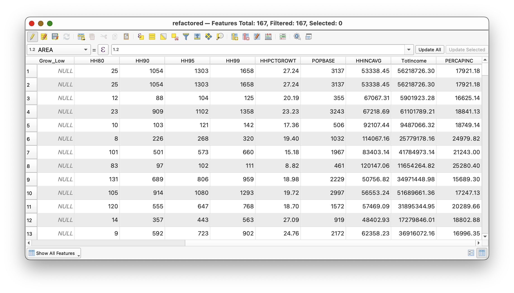

## Saving a Copy of a Joined Layer and Table

**Many operations will default to acting only on the selected records**, if there is a **selected subset**. Failure to clear an active selection will often produce partial results.

* **Select** the `demographics.shp` layer in the **Layers panel**, and open the attribute table.
* **Unselect** all features in the table, using the methods used in the previous exercise.
* Right-click on the `demographics.shp` in the **Layers panel**, and **Export>Save Features As...** a new shapefile named something like `tablejoin.shp`.  

This step copies the data in your temporary join to permanent storage, as a **shapefile**.  All items from the joined tables are saved to a new, usually larger table, with associated polygons (or points or lines).

Note that often the **column names are not copied**, e.g., each of the joined table columns is named something like “**more_data, more_data1, more_data2**….”  Easy, if tedious, to fix by renaming.  

If your installation doesn’t transfer column names, you can use the steps below to fix this:

* Open a new QGIS project , and add only the `tablejoin.shp` that you just exported.
* **Open the attribute table** for your `tablejoin` **layer**
* **Add** and **open** the `more_data.dbf` table, and sort in ascending order on the column named `BLKGRP` (remember, click on the name until you have an upward pointing triangle)
* Also **sort** the `tablejoin.shp` attribute table by the `BLKGRP` attribute.
* Arrange the two tables so that you can easily observe how the columns match those in `tablejoin` shapefile, that is, there is both a row and column correspondence.

We’ll want to change the **Field Names** in the exported `tablejoin.shp` shapefile to reflect those originally in the source `more_data.dbf`file.

We will use the **Refactor tool,** described on the next page, to **assign the name** `HH80` to the `more_data_` variable,  assign HH90 to more_dat_1, and so on** until the end.  Note that we do not assign `BLKGRP` to any of the new columns. As you might have noticed in the original join, and the columns of the exported file, `BLKGRP` is not copied, but rather the value comes from the original demographics shapefile.  

* Find or display the Processing Toolbox (if not shown, remember **View>Panels or Processing>Toolbox**)

* Type ‘Refactor’ into the **Search** at the top of the **toolbox**
* Double-click on the **Refactor fields tool **

This should open the Refactor table tool, shown in the figure below:

The target layer (“Input layer”) is listed near the top. Once the target layer is specified (here **tablejoin.shp**), the tool lists the source expression, Field name, type, and other characteristics of the existing fields.

We can modify the Field name directly.

1. Double click on the field name cell (not the source expression cell), and manually type the new name.
2. Do this for each of the Field names you wish to change, using the tables for reference.

4. **Browse** and **name** the **Refactored (Output) file**. Note that you can also overwrite the existing layer, but this isn’t recommended.  
3. After specifying the output file and editing all the Field names, your table should look something like the below screenshot.

5. **Click run**, and examine the attribute table of the resulting layer (which should be added to your project, by default).

## More Calculating into New Columns

Let’s practice adding items (columns), and modifying the values.  

We would like to know **total per capita income**.  We calculate this by multiplying the average household income by the number of households, and then dividing the result by population.  

1. Toggle the editing on , then add a new column 
2. Name the field something like  `TotIncome`, no spaces, no more than 10 characters
3. Make the **Type** “**Decimal number**”, **length 12**, **Precision 2**, then click on **OK**
5. **Open** the **Field Calculator tool** , and **Update existing field:** `TotIncome` as:

    `HH90 * HHINCAVG`

6. Click **OK**.

After the calculation, inspect the `TotIncome` column you just updated.

7. Use the **Field Calculator**, and the same field settings as the previous TotIncome  to **Create a new field** called **PERCAPINC** and **calculate** the per capita income as:

    `TotIncome / POPBASE`

Again, check the results.

8. **Save your edits**, and **toggle editing off**.

## To turn in:

Compose and export a map (PDF), with **5 Categories** using `PERCAPINC`.  Remember to include all the usual required map components, and note the classification method you used for the _**choropleth**_ map you are making.

Refer to [John Nelson’s blog post](http://uxblog.idvsolutions.com/2011/10/telling-truth.html) on Classification in choropleth mapping for advice on determining the appropriate classification method for this data.

Note that you can view the **Histogram tab** for your Field Values in the Layer Styling Panel, when your layer is selected to explore your options. To activate the Layer Styling Panel, on the **Main Menu:** **View>Panels>Layer Styling**
