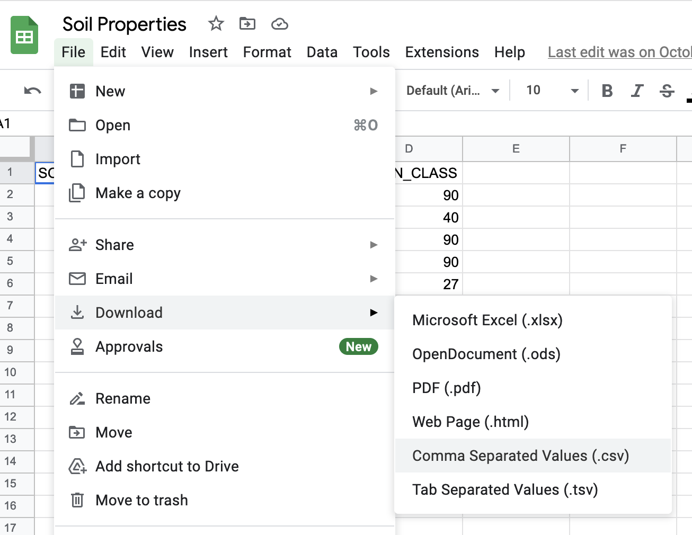
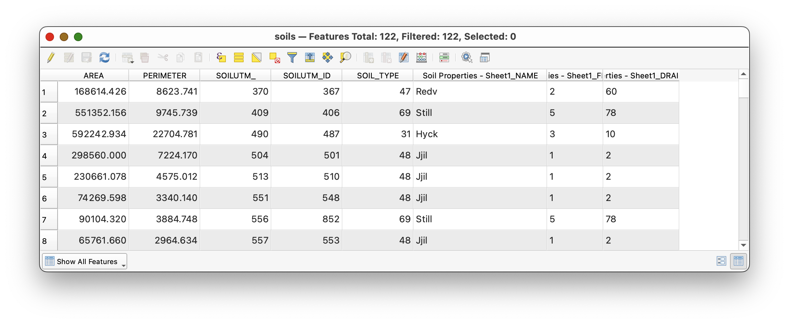

## Creating New Tables & Joining Tables

Creating a table and joining it to existing tables is a common operation.  Often, this join involves a one-to-many relationship between tables. Each record in one table matches many records in the second table. **For example, a typical county may have approximately 80 different soil types, but over 100,000 different soil polygons of these types.**

Therefore, we may have properties for each of the 80 different types, e.g., crop productivity, engineering properties, moisture characteristics.  We may format these in a table, and join this table to our existing county data layer. The repeated properties aren’t copied, just displayed for the appropriate polygon. This saves space, because we don’t have redundant copies of the soil properties information saved for each instance of a soil polygon in our data layer.

This exercise will give you practice in creating and joining tables, and the other techniques you learned in the first section of this lab

### Table Joins

1. Open a new blank project, and add the `soils.shp` data layer

2. Right-click on the **soils layer** and go to **Layer CRS>Set Project CRS from Layer**

3. Set a **Categorical symbology** based on the variable `SOIL_TYPE` (Don’t forget to click “**Classify**” to see your symbols)

You should have a layer displayed something similar to this:

The `SOIL_TYPE` attribute contains a code corresponding to the soil type of each individual polygon.  Notice there are 15 different soil types designated by numbers between 18 and 69.  There are 122 different soil polygons.  

In this exercise you will use the `SOIL_TYPE` variable in the soils shapefile as the **join item**, or **join column**. **_This is the “keyfield” that will be used in a join_**.  This join matches the table rows for layer `soils.shp` to a new soil properties table you will import.

1. Examine `SOIL_TYPE`, or proposed “keyfield” or "join column" in the target table, via the **Properties>Fields panel**.

This should display:

Note the **properties** of the `SOIL_TYPE` item, **especially the _Type_**, but **also the _length and precision_**. It is generally best for join keys to have the same type in both tables, e.g., we wouldn’t want to try to join an int to a double, or to text variables.

Now we need to download a new data table with information not included in the current table. We’ll then join this new table to **soils.shp**.

Download the  **[`SoilProperties.csv`](https://docs.google.com/spreadsheets/d/1iD5DjOD3nREz_jGUGGMMLikyvq23z9LrmB6zJWiJBjM/edit?usp=sharing), or comma separated value file**.  This is a text file with commas between each column entry, with a line in the file corresponding to each row.  **Excel, OpenOffice, Google Sheets or LibreOffice** are all spreadsheet software that allow you to easily enter the data in cells, then export it as a CSV formatted file, so if you ever need to create a table of this sort, its quite easy.

**Here is the link for the table you will download:**

[https://docs.google.com/spreadsheets/d/1iD5DjOD3nREz_jGUGGMMLikyvq23z9LrmB6zJWiJBjM/edit?usp=sharing](https://docs.google.com/spreadsheets/d/1iD5DjOD3nREz_jGUGGMMLikyvq23z9LrmB6zJWiJBjM/edit?usp=sharing)

1. Once you have the [Soil Properties Google Sheet](https://docs.google.com/spreadsheets/d/1iD5DjOD3nREz_jGUGGMMLikyvq23z9LrmB6zJWiJBjM/edit?usp=sharing) open, use **File>Download>Comma-separated values (.csv)** to download to your computer.

2. Use the **Browser panel** to browse to the location that you downloaded the `SoilProperties.csv` to and **right-click** it to **Add Layer to Project...**  

3. This should add the table to your QGIS **Layers panel**.  Left-click and open the new table, verifying the values for rows and columns.

4. Examine the **attributes** of the `SoilProperties.csv` table

5. **Join** the `soils` layer **attribute table** and the `SoilProperties.csv` table you just added, using the **Join tab**, from the  soils layer **Properties**. Remember to use the common field `SOIL_TYPE` to join the files. If you are unclear on how to join, refer to the instructions on joining earlier in this lab.

6. Open the **Attribute Table** of your newly joined **soils layer**  to confirm the new data  has been properly joined.

7. Note that, although you have many more records in your original `soils layer` (122) than your `SoilProperties.csv` (15)

## To turn in:

After you’ve completed the join, create a map (PDF) using the new soils data.  

* Display soils in a categorical map using the `NAME` field, added from the `SoilProperties.csv`  
* Use the Add Attribute Table toolto add your **SoilProperties.csv** table to your layout. Experiment with the **Item Properties** (particularly the **Attributes Button** to clean up the header labels), for formatting the table.
* Remember that **unchecking Auto update** for your **legend** allows you to click on individual items in the legend and remove or edit (Edit item button:) their appearance in the layout.

* Add the usual map elements (title, name, CRS, scale, basemap, orientation, etc…), and export a **PDF** of your map.

I’d like to stress the utility of what you’ve just done.  You will often want information grouped and displayed in different ways, and joins are then used to add information to and produce maps, often from pre-existing boundary datasets.  Geographic data may be joined to many different sets of tabular data that aggregate characteristics we are interested in. These joined sets may be selected based on many combinations of attributes, greatly increasing the flexibility and utility of data in a GIS.
