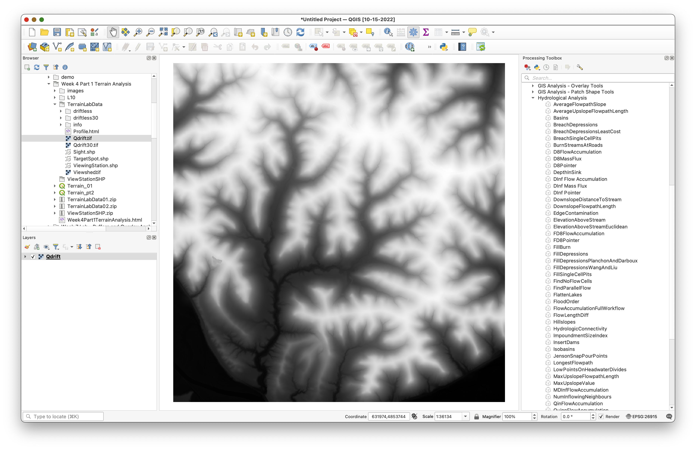
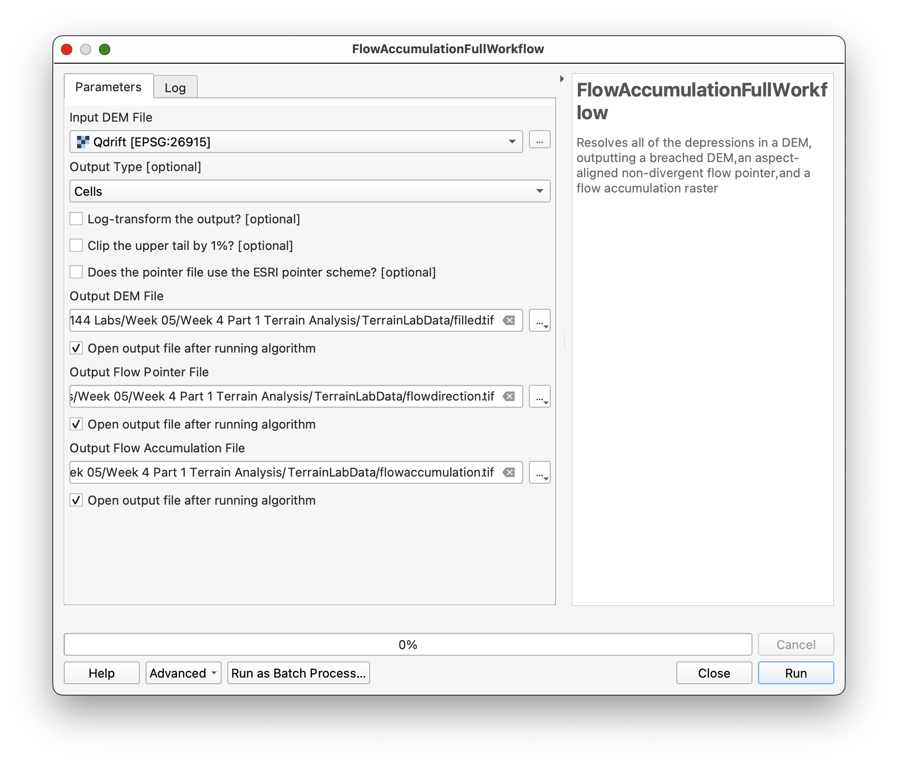
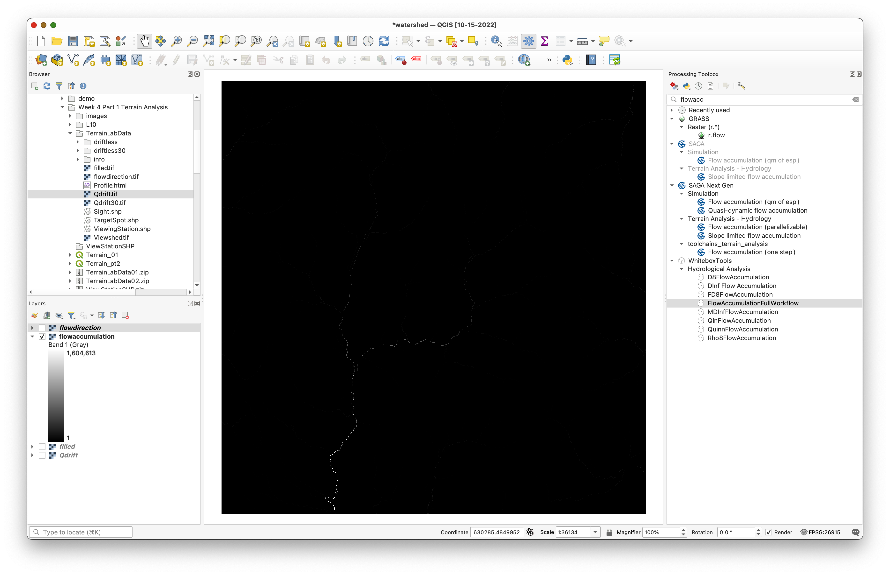
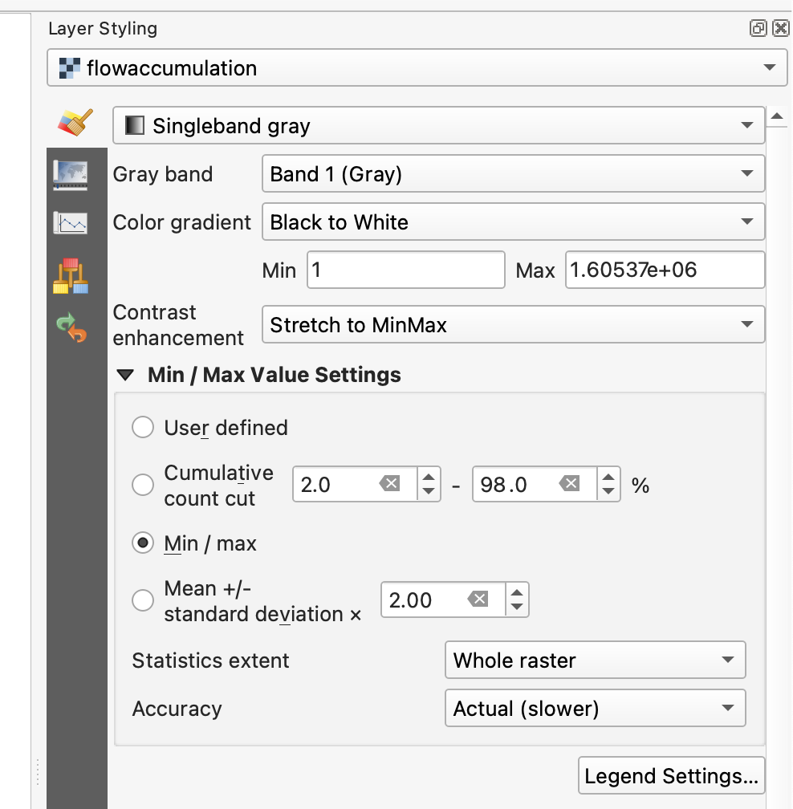
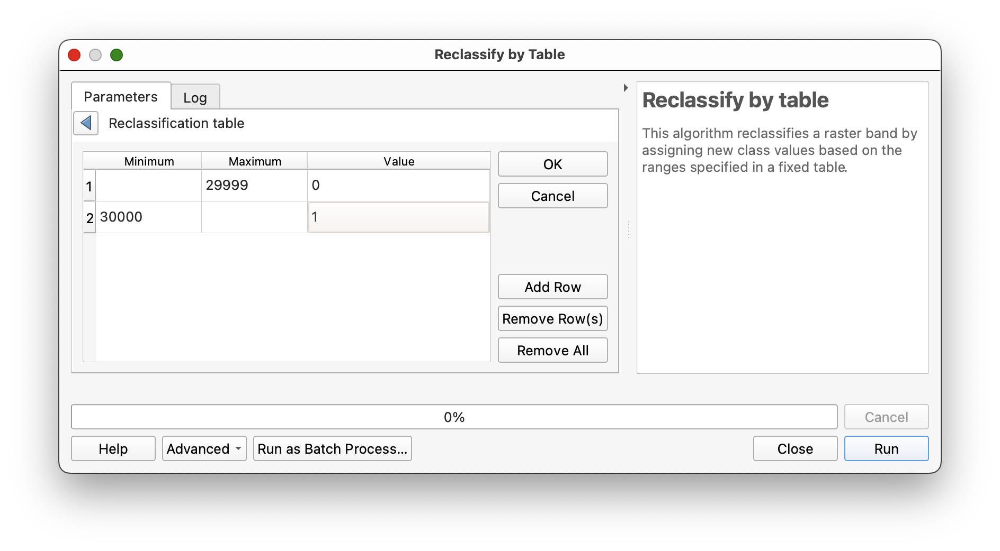
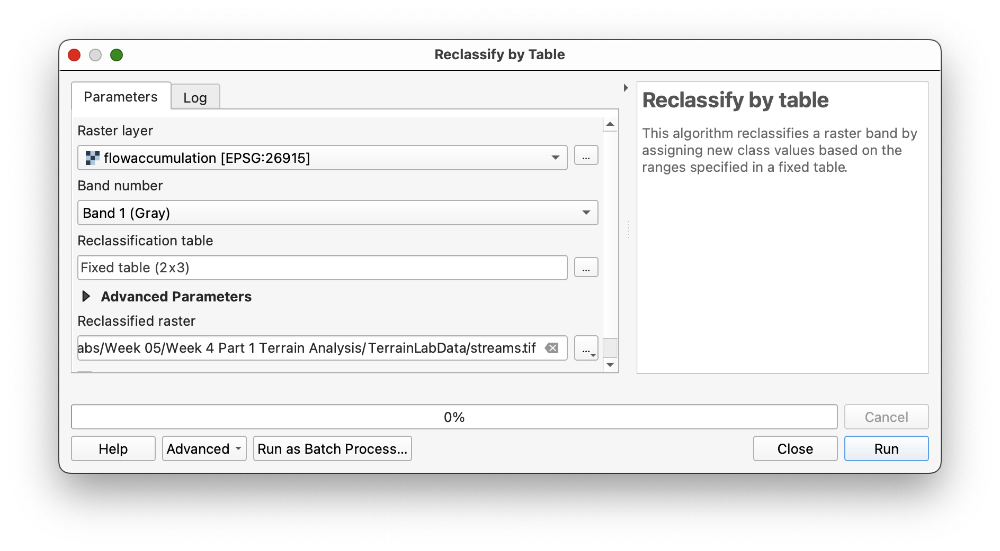
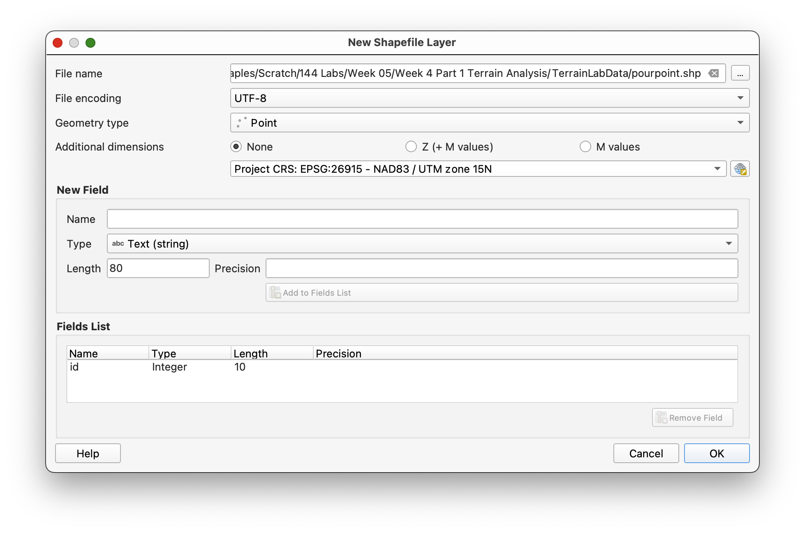
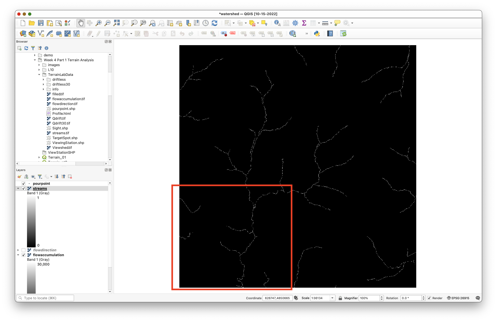
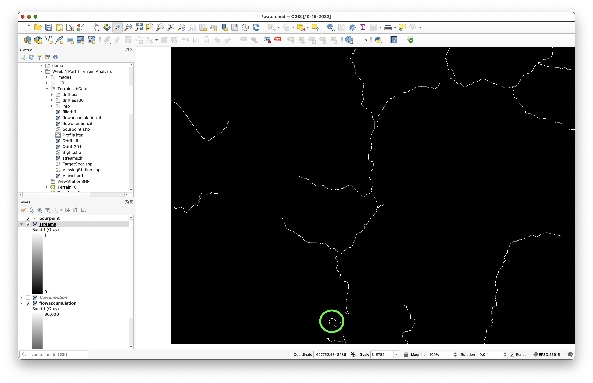

# Project 2: Watershed Functions

Again we’ll be using **WhiteboxTools** in QGIS for this new project, to calculate watershed boundaries based on elevation data.

1. Open a new Project and add the `Qdrift` **DEM**
2. Open the **Processing Toolbox** Panel and Expand **WhiteboxTools>Hydrological Analysis**. This should display the tools shown at the right-side of the below image.

Hydrological modeling is one of the most powerful capabilities of GIS applications, and can involve dozens of steps, from **pre-processing/conditioning** a DEM for use in a model, to fine-tuning the end results of a model for a particular application. We’ll be using a single tool, **FlowAccumulationFullWorkflow** from the WhiteboxTools Toolbox, but you should be aware of what each of the Outputs of this tool is…

## Fill

We use the fill command to fill pits in the DEM, as described in chapter 11 of GIS Fundamentals. The simplest of watershed processing routines begin by simply filling the pits. More sophisticated ones may fill the pits, and “burn in” a stream line, along which the DEM is lowered after filling to maintain a downstream flow.

## Flow Direction

As noted in the textbook, this flow direction layer will contain a set of numbers that define the _cardinal_ and _sub-cardinal direction_ that a drop of water will flow from a given pixel. This is the first step to modeling the behavior of water, in a GIS context.

You will note that there are more than a single version of some tools, in **WhiteboxTools**, for particular processing functions. **Flow Direction** is one of those tools that has more than one version. The different versions make use of different algorithmic methods to arrive at the calculations, and you can find more information, including the original papers defining each algorithm, here: [https://www.whiteboxgeo.com/manual/wbt_book/available_tools/hydrological_analysis.html](https://www.whiteboxgeo.com/manual/wbt_book/available_tools/hydrological_analysis.html)

## Flow Accumulation

**Flow accumulation** finds the highest points, and accumulates the area (or number of cells) downhill, according to the **flow direction**, which we calculated, above. We will then use this **flow accumulation grid** to approximate where streams will be found on the surface, and to determine outlet points for watersheds.

## Running the FlowAccumulationFullWorkflow Tool

1. From the **Processing Toolbox** Panel, Search for the `FlowAccumulationFullWorkflow` tool, and launch it.
2. Use `Qdrift` as your **Input DEM File**
3. Set the **Output Type** as `Cells`
4. Assign the following names to the Output files:
    1. **Output DEM File**: `filled.tif`
    2. **Output Flow Pointer File**: `flowdirection.tif`
    3. **Output Flow Accumulation File**: `flowaccumulation.tif`
5. Click **Run**

6. Close the tool window, and examine the Layers you have added.
7. Toggle off all but the `flowaccumulation` Layer.

You should have something like, below. (there will be a faint line of hydrology from the bottom left side of the `flowaccumulation` layer)

**_Notice the maximum and minimum value for the data layer_**, they will be something like 36k and 1. These are actually not the real values, but an estimate of the values, that QGIS makes, based upon a sampling of raster cells. In reality, the values of the raster cells in this layer go all the way up to 1.6 million, based upon the number of cells. In this step, we will reclassify our FlowAccumulation layer in order to better see the hydrology network, and limit our cell values to those that represent part of the network..

We can see the actual values of our Raster Dataset if we:

1. Open the **Layer Styling Panel** with the `flowaccumulation` layer selected.
2. Expand the **Min / Max Value Settings** Options
3. Change **Accuracy** to `Actual (slower)`, as shown below

When you change the Accuracy Setting, you should see the Max Value update, in the Layer Styling Panel, as well as the values shown in the Layer Panel legend

## Reclassification

Now we will Reclass our FlowAccumulation layer, so that the only values are 1 and NoData, depending upon a threshold we decide upon.

1. For this, we will use the **Reclassify by Table tool**, from the **QIS>Raster analysis toolset in the Processing Toolbox**
2. Use `FlowAccumulation` as the **Input Raster Layer**.
3. Expand the **Advanced Parameters **and **Check** the option to `Use no data when no range matches value`
4. Click on the **...** button to the right of the **Reclassification Table** field, to launch the **Reclassification Table Dialog**

5. Click **Add Row**, and enter the following:
    1. **Minimum**: _LEAVE BLANK_
    2. **Maximum**: `29999`
    3. **Value**: `0`
5. Click **Add Row**, and enter the following:
    1. **Minimum**: `30000`
    2. **Maximum**: _LEAVE BLANK_
    3. **Value**: `1`

6. Click the **OK button** to save the table and return to the **Reclassify tool**.
6. **Name** the **Output Raster** `Streams.tif`

This, combined with the option to use NoData for values outside the range of our table, should result in a layer with only 1’s where we have modeled a stream.

## Identifying the Outlet point for the Watershed

We do this reclassification to assist in locating the outlet point. We need to ensure that the outlet point is directly on a stream cell. We must create a **_pourpoint_**, the location on a stream at the base of a watershed.

#### Start by creating an empty point shapefile:

1. Use **Layer>Create Layer> New Shapefile** to create a new **Point Shapefile**, called `PourPoint.shp`, using the CRS of the other layers, and the Project.

1. Arrange the Streams layer in the Layers Panel until it is visible and just below the PourPoint.shp
2. Zoom to the southwest quadrant of the screen and find the area shown in the image below:

You must digitize a watershed outlet point, on the network (within the green circle shown).

1. Right-click on the `PourPoint` Layer and go to **>Toggle Editing** and make sure your digitizing toolbar is on.

2. Use the Add Point Feature button  to create a single point, using the image above as your guide to placement. Try to place the point as close to on top of a stream pixel, as possible.
2.Toggle Off Editing and **Save your Edit** for `PourPoint`.

#
**Snap the Pour Point**

1. Search for the **SnapPourPoints **tool in the Processing Toolbox.
2. Specify **PourPoint.shp** as your **Input Outlets File**,
3. Use the FlowAccumulation from your earlier **FlowAccumulationFullWorkflow** tool, earlier, as the **Flow Accumulation Raster**
4. A new output shapefile to contain your pour point, name it SnappedPoint.shp.
5. Use a Snap distance of 9 (about 3 cells)
6. Click  Run

>>>>>  gd2md-html alert: inline image link here (to images/image7.png). Store image on your image server and adjust path/filename/extension if necessary.  (<a href="#">Back to top</a>)(<a href="#gdcalert8">Next alert</a>) >>>>> 

>>>>>  gd2md-html alert: inline image link here (to images/image8.png). Store image on your image server and adjust path/filename/extension if necessary.  (<a href="#">Back to top</a>)(<a href="#gdcalert9">Next alert</a>) >>>>> 

This should create a shapefile with a single point, near your digitized outlet.(see the red point in the image, above)

# Watershed Modeling

Now we will use the layers we have created to model the watershed of the stream network we have just created the PourPoint for. This is the area within which all water will, theoretically, flow through the point we have created.

1. Search for the Watershed tool, from the WhiteboxTools.
2. Use FlowDirection as the D8 Pointer File
3. Use SnappedPoint.shp as the Input Pour Points
4. Name your Output file: watershed.tif

>>>>>  gd2md-html alert: inline image link here (to images/image9.png). Store image on your image server and adjust path/filename/extension if necessary.  (<a href="#">Back to top</a>)(<a href="#gdcalert10">Next alert</a>) >>>>> 

This should create a watershed layer something like that below.

>>>>>  gd2md-html alert: inline image link here (to images/image10.png). Store image on your image server and adjust path/filename/extension if necessary.  (<a href="#">Back to top</a>)(<a href="#gdcalert11">Next alert</a>) >>>>> 

##
**Raster to Vector Conversion**

1. **Search** for the **RasterStreamstoVector** tool from WhiteboxTools and launch it.
2. Use your **Streams.tif **Layer (the one you reclassified to 1’s and NoData) as the **Input Streams File**
3. **Use your FlowDIrection **layer as the **D8 Pointer File**
4. **Name the outpu**t something like **StreamNet.shp**
5. Click Run

>>>>>  gd2md-html alert: inline image link here (to images/image11.png). Store image on your image server and adjust path/filename/extension if necessary.  (<a href="#">Back to top</a>)(<a href="#gdcalert12">Next alert</a>) >>>>> 

This should result in a new layer that contains Vector Line features for your Stream Network. You may need to change the order of your layers to see the streams from your newly created watershed.

**Save your work!**

#
**To Turn In**

Now, create a layout displaying:

* **Qdrift.tif DEM & Hillshade.tif** (remember the 50% transparency, trick)
* **Watershed.tif**,
* **SnappedPoint.shp**
* **Streamnet.shp**
* **ViewingStation.shp**
* **Sight.shp**
* **Visible.tiff** (From the Viewshed exercise, using Paletted/Unique values you can use the remove tool

>>>>>  gd2md-html alert: inline image link here (to images/image12.png). Store image on your image server and adjust path/filename/extension if necessary.  (<a href="#">Back to top</a>)(<a href="#gdcalert13">Next alert</a>) >>>>> 

 to get rid of  0 values, in the Layer Styling panel)
* **Elevation Profile** added as an image to the layout

Use all the usual expected cartographic elements, and creativity.

Export as a .pdf.

You can almost certainly do better than this:

>>>>>  gd2md-html alert: inline image link here (to images/image13.png). Store image on your image server and adjust path/filename/extension if necessary.  (<a href="#">Back to top</a>)(<a href="#gdcalert14">Next alert</a>) >>>>> 

Note that I used to teach raster later in the quarter, but have recognized it is better to be exposed to it, earlier, so we are now in Week 4, not Week 7.
