## Not ready for assignment

# Being John Snow: Basic Point Pattern Analysis & Spatial Statistics with QGIS

## Overview

## Before Getting Started

Do yourself a favor and get acquainted with the story of the **Cholera Outbreak of 1854**, [Dr. John Snow](https://www.ph.ucla.edu/epi/snow.html) and Reverend Henry Whitehead, with [Steven Johnson's "Ghost Map" TED Talk](https://www.ted.com/talks/steven_johnson_how_the_ghost_map_helped_end_a_killer_disease), based upon his book:

`The Ghost Map: The Story of London's Most Terrifying Epidemic-and How It Changed Science, Cities, and the Modern World. New York: Riverhead Books, 2006.`

### Data

The data package for the lesson can be downloaded from [https://github.com/mapninja/QGIS-101/archive/master.zip](https://github.com/mapninja/QGIS-101/archive/master.zip)

The project contains the following datasets:

* `Water Pumps` - this is a spatial data file containing the locations of all of the water pumps recorded in John Snow's original map of the cholera outbreak.
* `Deaths`  - this is a GeoJSON file for addresses affected by the cholera outbreak. The table contains the number of deaths at each address, as `Num_Cases`.  
* `Study Area` - This file is simply a rectangular feature that describes our area of interest.  
* `1854 Cholera Outbreak` - this is a geo-referenced image of the map from John Snow's original report on the cholera outbreak of 1854.  

## Getting started  

1. Open the QGIS Project called `Being_John_Snow` from the unzipped data folder.

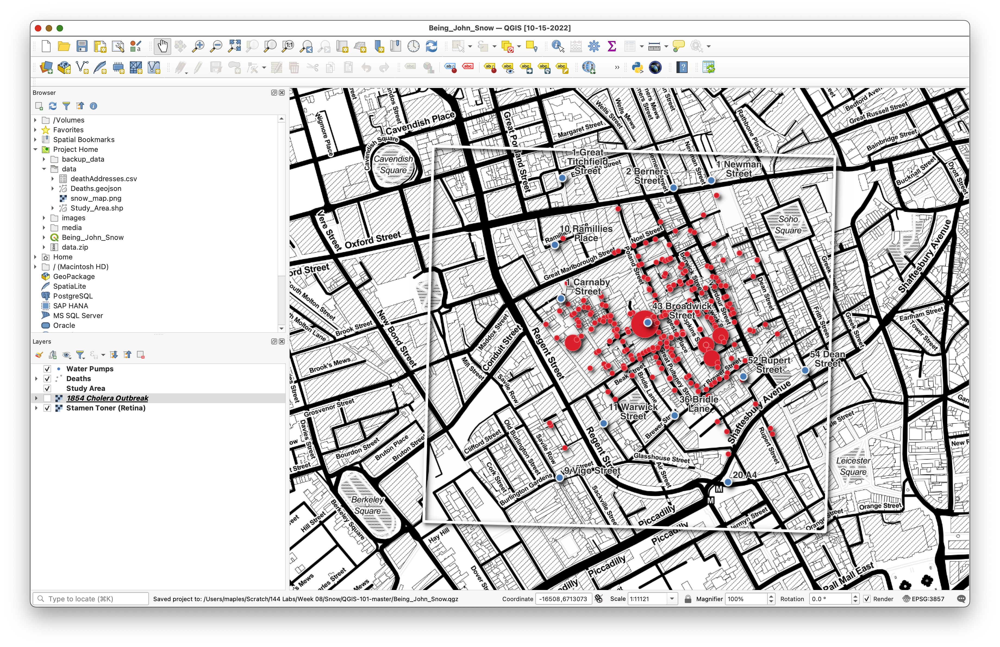

### View the Attributes of `Deaths` Layer

Examine the attributes

1. Right-click on the `deathAddresses` layer in the **Layers** panel and select **Open Attribute Table**.
2. Sort on the `Num_Cases` field, scroll, select by attributes, etc...

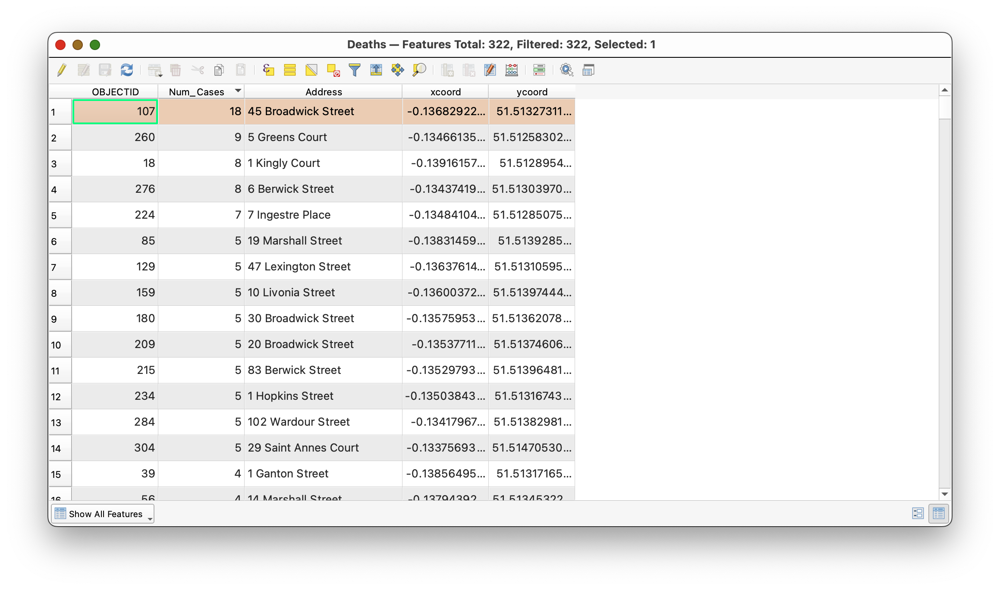

### Statistics on a field  

As mentioned, above, the `Num_Cases` field in the Death Addresses data indicates the number of deaths at each address in the dataset. You can get a simple statistical snapshot of the variable from the Attribute Table.

1. Close the Attribute Table
2. On the pull-down menu go to **Vector > Analysis Tools > Basic Statistics for Fields**
3. On the window select **Death Addresses** as the Input Vector layer and **Num_Cases** as the Target field.
4. **Click Run** and **Close**
5. Look for the **Results Viewer** panel which should have been activated, and click on the **Hyperlink** to open the summary in a web browser.

## Basic spatial data analysis

### Using Voronoi (Thiessen) Polygons for Spatial Allocation

Thiessen polygons allocate space in an area of interest to a single feature per polygon. That is, within a Thiessen polygon, all other features are closer to the point that was used to generate that polygon than to any other point in the feature set. In this case, we will create a set of Thiessen polygons based upon the locations of the Water Pumps in our project. This will allow us to easily allocate all of the points in our death addresses dataset to the water pump that they are nearest using a simple spatial join.

1. On the Main Menu go to menu go to **Processing \> Toolbox**
3. Search for **Voronoi**
4. **Double–click** the **Voronoi polygons** tool
5. On the Voronoi tool select `Water Pumps` as the **Input layer.**  

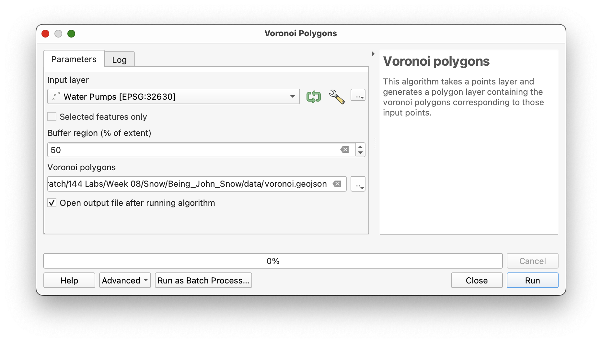

6. Set the **Buffer region** to **50%**
7. Browse and save the  Voronoi polygons output as `voronoi.geojson`, changing the filetype to **GEOJSON files (*.geojson)** in the **Save File** dialog:

6. Click **Run** to create the `voronoi` polygon layer.
7. Drag the resulting layer below your water_pump_projected layer and adjust the symbology to be an outline, only, as shown.

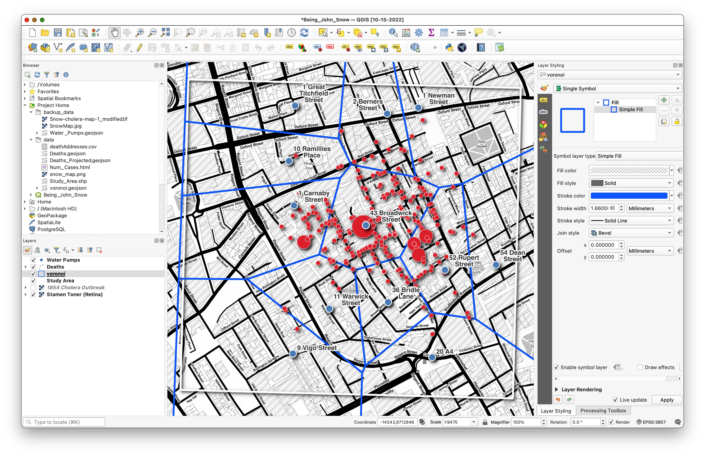

### Spatial Joining Points to Polygons (Point Aggregation)

Now that you have created the Voronoi polygon layer, you will “allocate” each of the deaths to one of the Voronoi polygons. To do this, we will use the **Join Attributes by Location** tool. Conceptually, what we will be doing is like passing our points through the polygons so that the polygon's attributes "stick" to the points. In this way, we will "tag" each Death Record, with the Water Pump record that is nearest.

1. On the main menu go to **Vector>Data Management Tools>Join attributes by location**

2.  Select `Deaths` as the **Join to features in... layer** and `Water_Pump_Voronoi` as the **By comparing to... layer**.
3. Use `WP_` as the **Joined field prefix**

3.  **Click Browse** to save the output as a **GeoJSON** file and name it something like **Deaths_Allocated** in your **Data** Folder.

4.  **Click OK**

5.  **Close** the **Join the attributes by location** window.

6.  The resulting `Deaths_Allocated` layer is added to the **Map Canvas**.
7. **Open** its **attribute table** to confirm that the attributes of the Water Pumps have been transferred:  

### Summary Statistics

Finally, we would like to summarize the deaths in the outbreak, grouping our summary by the **name of the Water Pump** that each `Death Address` is nearest. We will do this using the **Group Stats Tool** which allows us to do a statistical summary similar to the one we did earlier on the entire data set, but this time grouped by nearest water pump.

If you haven't installed **Group Stats**, already:  

1.  On the pull-down menu go to **Plugins\> Manage and install plugins.**
2.  On the Plugins window search, type **Group Stats** and select it.
3.  Click on **Install plugin.**
4.  Close the **Plugin Window.**  

After the installation a **GroupStats Tool**:

1. On the Main Menu, go to **Vector>GroupStats>GroupStats**
2. **Select** `Deaths_Allocated` as **Layer**.  
3. **Drag** from **Fields** to **Column**: `average, count and sum`.
4. On **Rows**, drag `WP_Name` (originally from the Water_Pump data layer), and
5. On **Value** drag `Num_Cases`
6. **Click** on **Calculate** to visualize the summary table.
7. **Click** the `sum` field header on the resulting table to **Sort descending** on the `sum` field.

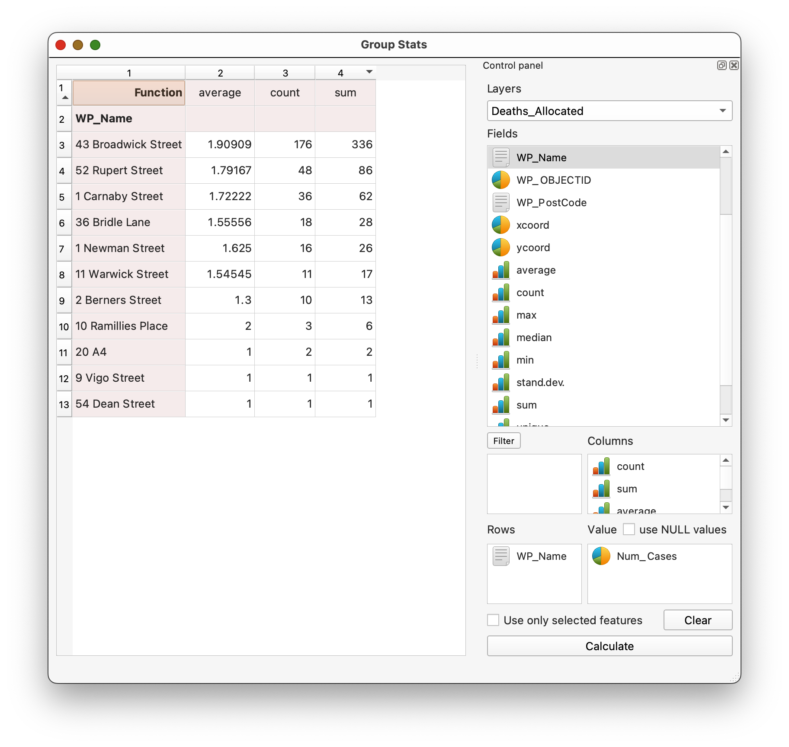

Note that the **Broadwick Pump** has the highest value for two of three
significant attributes: **Count** (No. of households), **Sum** (Total Deaths),
and **Average** (Mean Deaths per Household).

1.  On the **Main Menu** go the **Data>Save all to CSV file. Save** the **Ouput Table** to your **Data** Folder and name it `Deaths_Summary_by_Pumps.csv`.
2.  **Close** the **Group Stats** Window
3. Add the `Deaths_Summary_by_Pumps` CSV back to the Project, you will use it later in your Map layout.

## Basic Measures of Spatial Central Tendency

### Spatial Mean (Mean Center)

The **Mean Center** is the average x- and y-coordinate of all the features in the study area. It's useful for tracking changes in the distribution or for comparing the distributions of different types of features. Here, we will use the **Mean Center** to highlight the distribution of deaths around the **Broad Street Pump**.  

First, we will calculate a simple spatial mean. This is simply the mean center of the **distribution of locations**.

1. On the pull-down menu go to menu go to **Vector> Analysis> Mean
coordinate(s)**  
1. Select `Deaths_Allocated` as the Input vector layer.
2. Leave the **Weight field** and **Unique ID field** **unspecified**
3. Click **Browse** to **save** the **Output GeoJSON** as: `Deaths_Spatial_Mean` to the **Data** Folder**.**

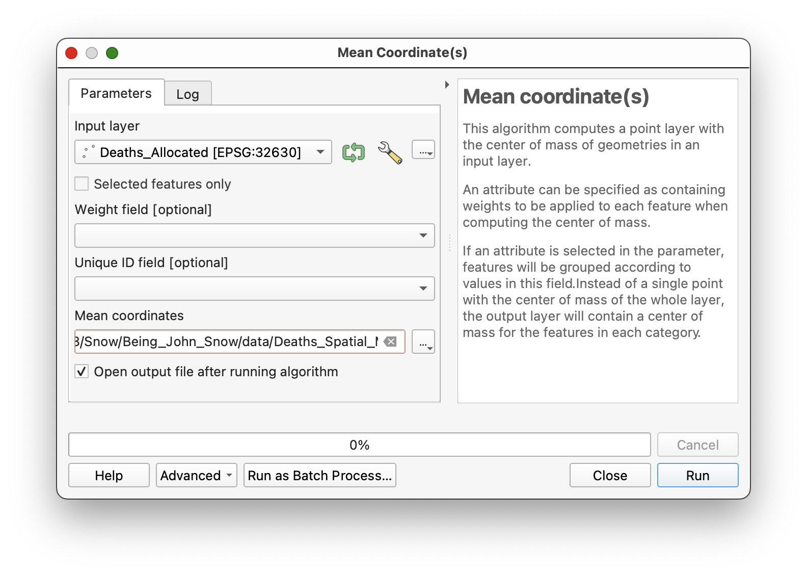

4. **Click OK** to calculate the **Mean Center** and **Close**.
5. Change the **Symbology** for the **Deaths\_Spatial\_Mean layer** to something that contrasts with the other symbologies.

### Weighted Spatial Mean

The Weighted Spatial Mean takes into account some "intensity" value to amplify the effect of particular locations on the Spatial Mean. In this case, we will use the `Num_Cases` variable to weight each location, based upon the number of deaths at the address.

1. **Run** the **Mean Center tool** again, this time assigning the
   **Num_Cases** field as the **Weight Field**.
2. **Save** the **Output Shapefile** to the **Data** folder and name it `Deaths_Weighted_Spatial_Mean`.

3. **Apply a symbology** to the `Deaths_Weighted_Spatial_Mean` layer.

### Cased Weighted Spatial Mean

It is also possible to calculate several spatial means, by grouping points based upon a nominal, or class variable. In this case, we will use the `WP_Name` field to calculate a unique weighted spatial mean for each subset of Deaths, based upon their proximity to a water pump, as we identified in the previous Spatial Join, task.

1. **Run** the **Mean Center tool** again, this time assigning the
   **Num_Cases** field as the **Weight Field**.
2. Set the `Unique ID` option to the `WP_Name` field
3. **Save** the **Output Shapefile** to the **Data** folder and name it `Deaths_Cased_Weighted_Spatial_Mean`.  

Observe the results. This has the effect of "casing" the spatial mean, based upon the spatial allocation that we did earlier. Notice how the Spatial Mean of each individual cluster of `Deaths` seems to be "pulling" toward the centrally located **Broadwick Street Water Pump**.

Update the styling and toggle off various layers to note the Spatial Means calculated from the Deaths.

### Standard Distance

The Standard Distance is the spatial statistical equivalent of the standard deviation. It describes the radius around the spatial mean (or weighted spatial mean), which contains 68% of locations in your dataset (or 95%, or 99%). It can be very useful for working with GPS data.

1. On the pull-down menu go to menu go to **Processing \> Toolbox** to open the
**Processing Toolbox Window.**

On the **Processing Toolbox Window type** to **search**: **Spatial point pattern
analysis** and **double click** to open the tool window.

1.  Select `Deaths_Allocated` as the **Point** layer.

2.  Click the 3 dots and **Select** Save to a file.

3.  **Give** an appropriate name and **Save** the **3 Output Files** on your
    **Data** folder.

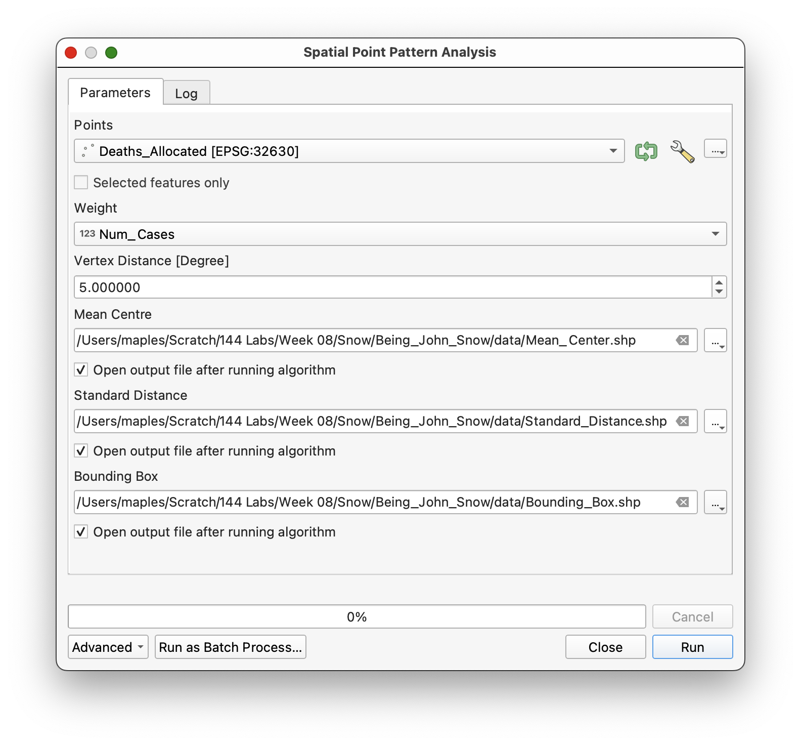

**Click Run** to calculate the **Standard Distance, Mean Centre and Bounding
Box.**

The red cross is the mean center (no weight field; the large circle is the standard distance, which gives an indication of how closely the points are distributed around the mean center; and the rectangle is the bounding box, describing the smallest possible rectangle which will still enclose all the points.

### Creating a surface from Point Data to Highlight “Hotspots”

#### Kernel Density

The Kernel Density Tool calculates a magnitude per unit area from the point features using a kernel function to fit a smoothly tapered surface to each point. The result is a raster dataset which can reveal “hotspots” in the array of point data.

Note: Project your `Deaths_Allocated` data to the `EPSG:32630` UTM coordinate system, before running the  next steps.

1.  Go to the **Processing Toolbox Window** and **type** to search **Kernel Density Estimation (SAGANP)** and open the tool.
2.  **Select** the `Deaths_Allocated` layer as the **Points** features.
3.  Select `Num_Cases` as the **Weight Field.**
4.  Set the **Radius** option to `50` (the tool uses the linear unit of the layer CRS for the units, which in this case is in meters).
5.  On the **Output Extent** option, click the dropdown and select **Use layer/canvas extent**, then select `Study Area` and **Click OK.**

6.  On the resulting window search for
7. Set the **Cellsize** to 1 (this is also in meters)
8.  **Save** the **Output Raster** as `Kernel_Density`

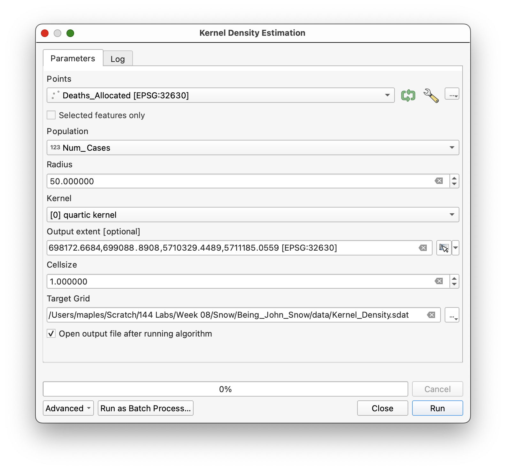

9.  **Click Run** to run the **Kernel Density tool**.

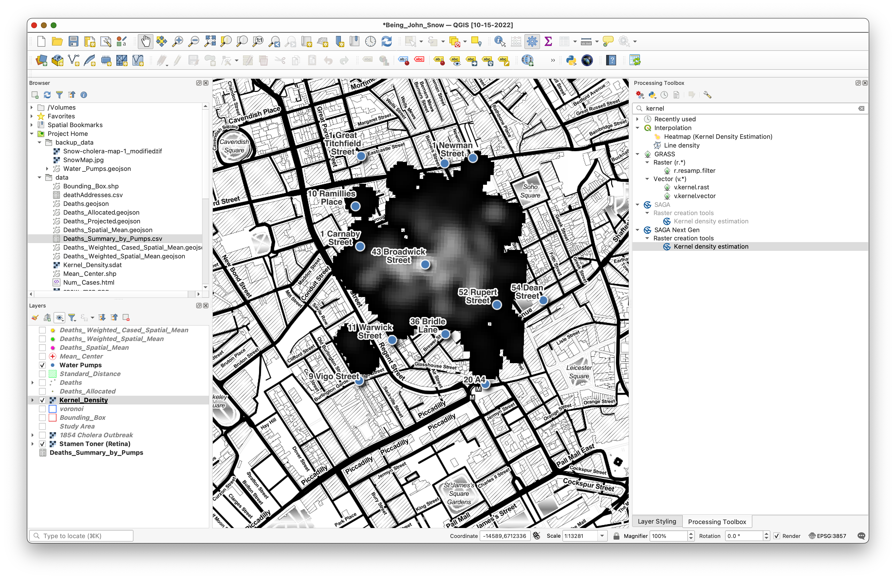

10. Experiment with **Singleband pseudocolor Styling** for the `Kernel_Density` layer

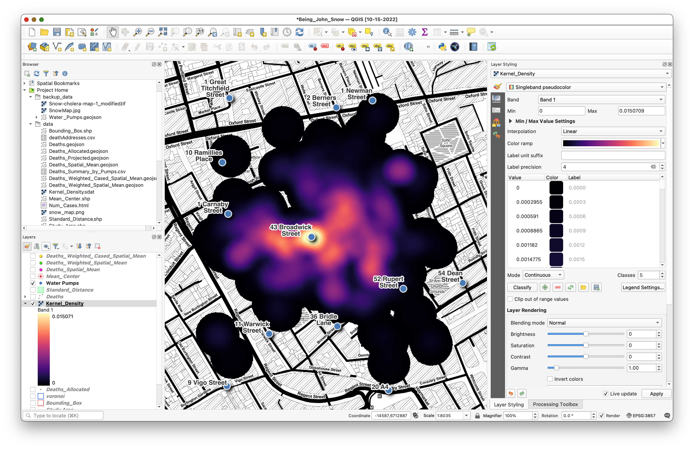

Note the proximity of the "hotspot" and the Broad(wick) Street Water Pump.

# To Turn In:

You should now have the following analytic layers in your Project:
* `Voronoi` Polygons
* `Deaths_Spatial_Mean`
* `Deaths_Weighted_Spatial_Mean`
* `Deaths_Cased_Weighted_Spatial_Mean`
* `Kernel_Density`
* `Standard_Distance`

As well as the original layers from the initial project:
* `Deaths`
* `Water Pumps`
* `1854 Cholera Outbreak`

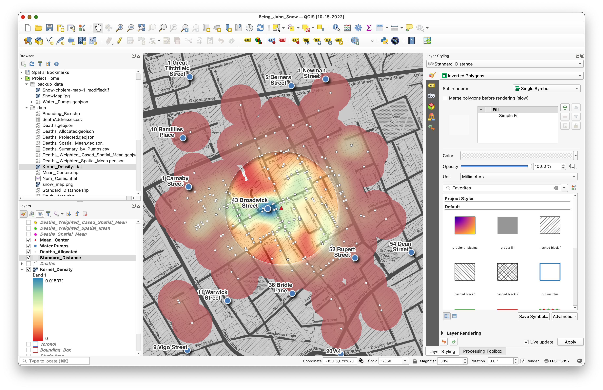
